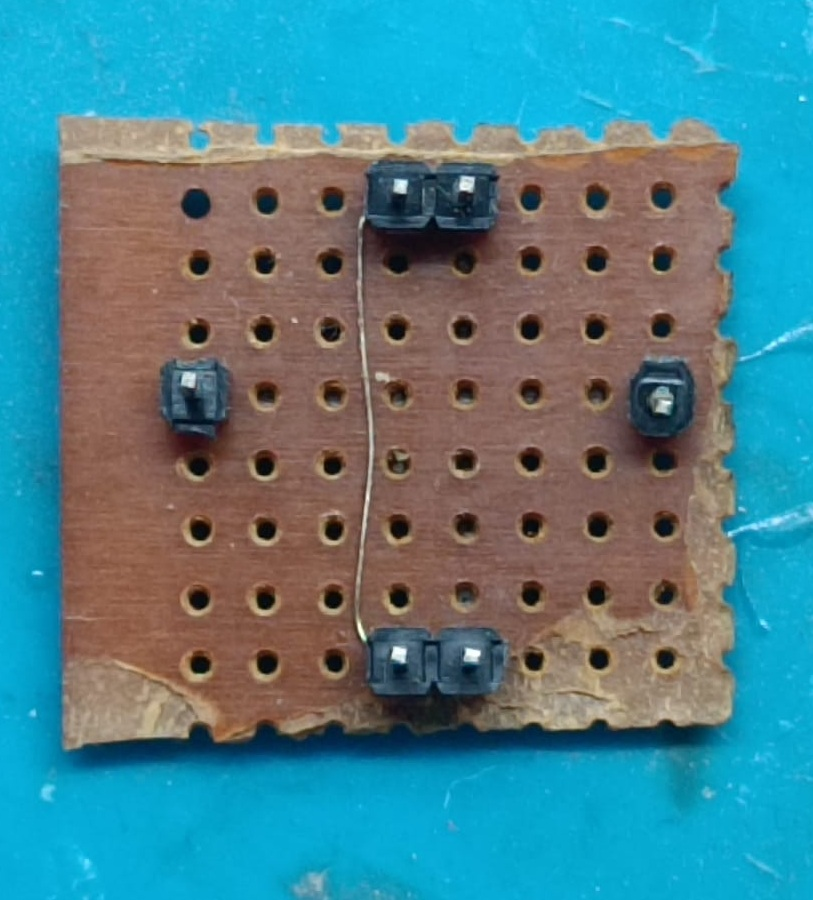
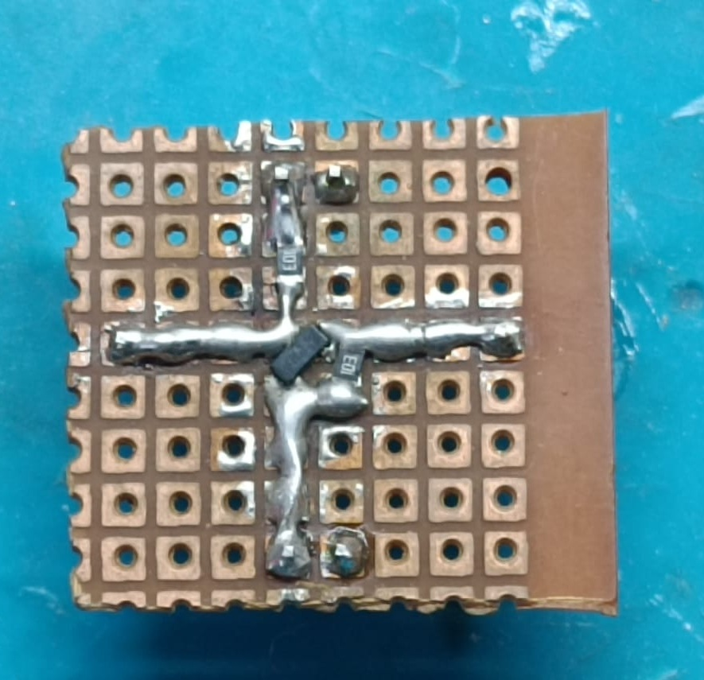
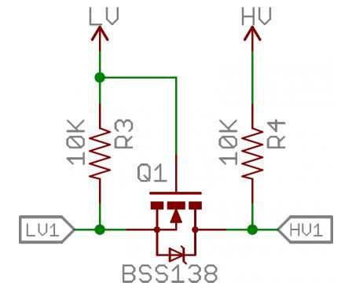
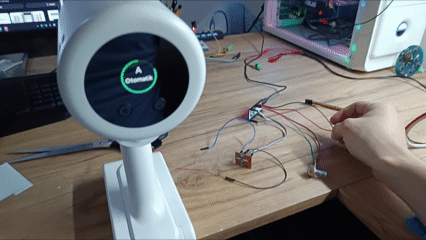
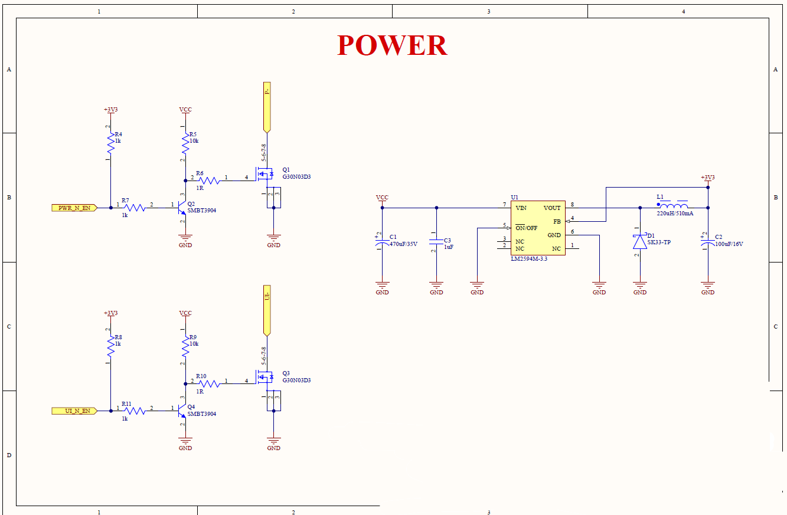
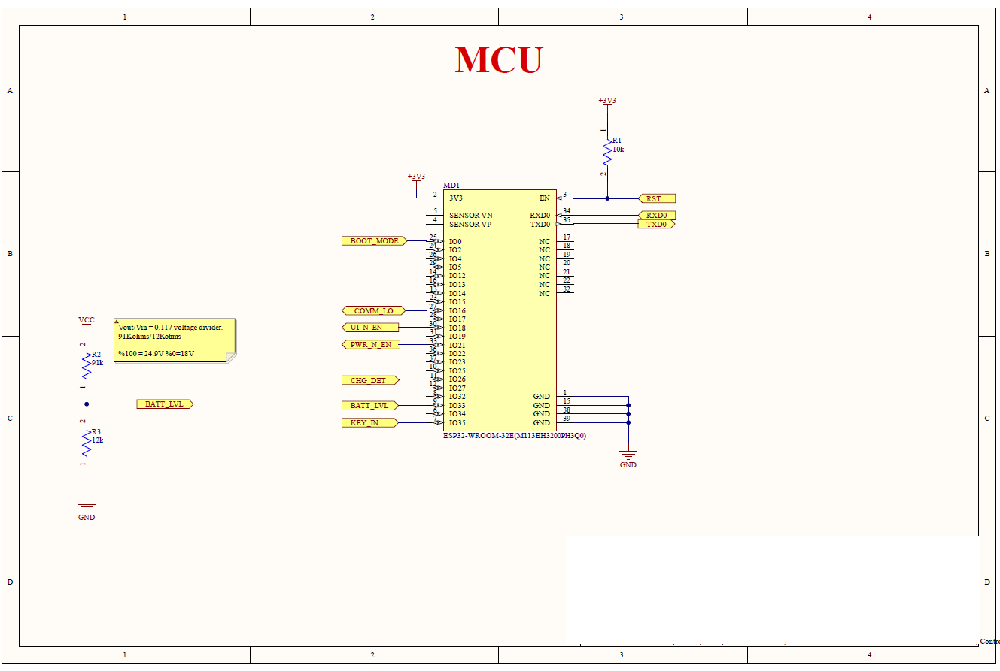
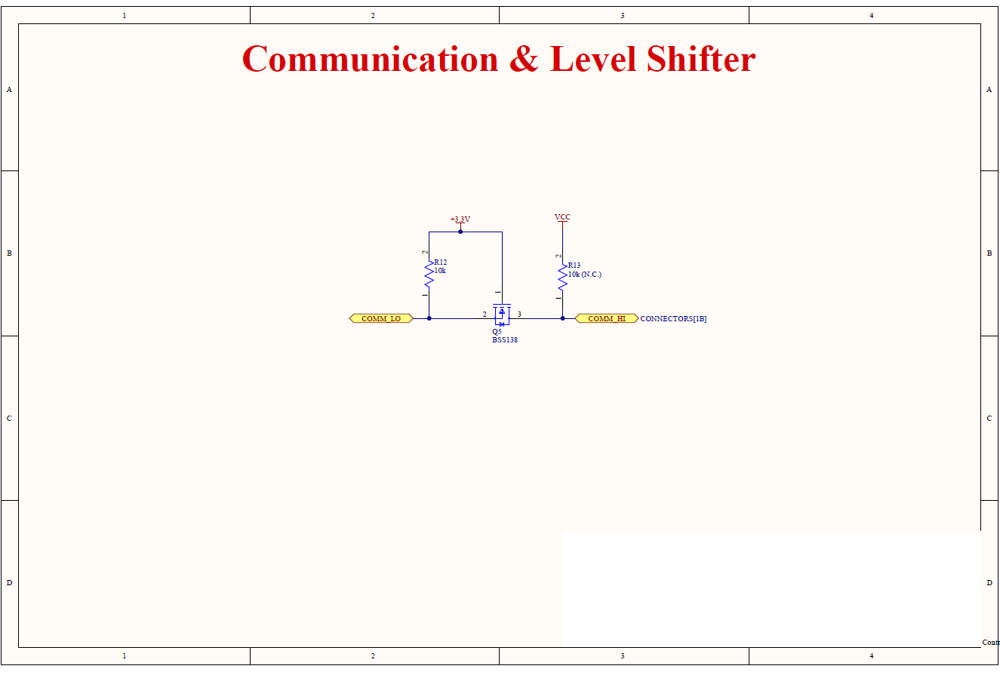
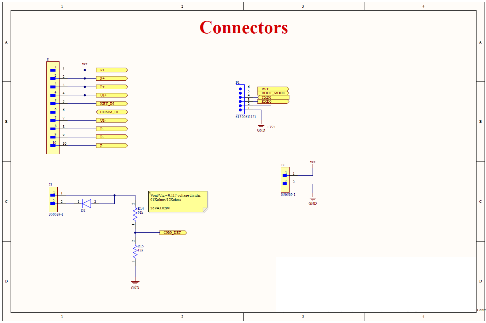
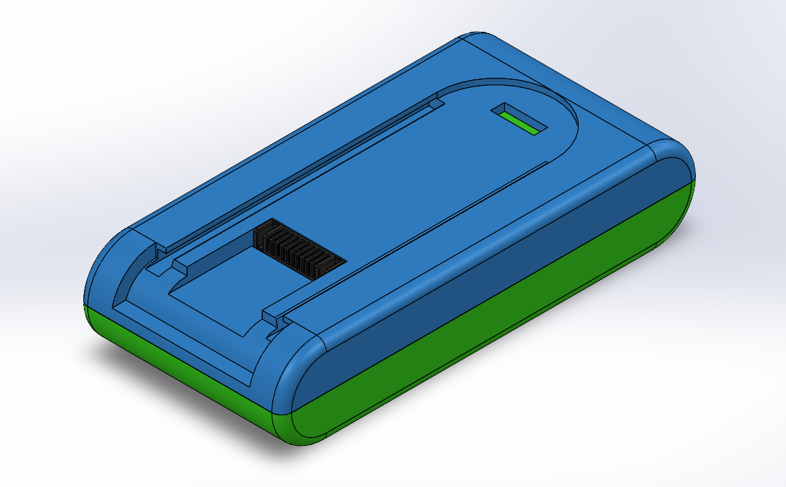
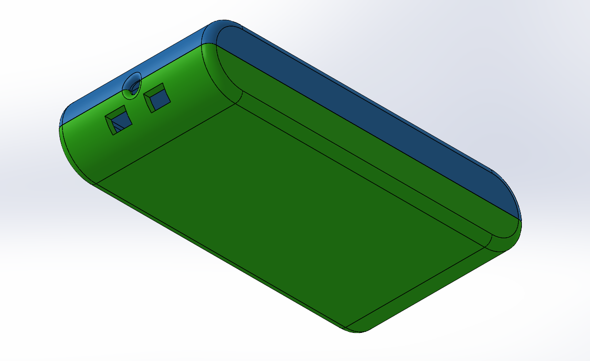

# Language Selection
[English](README-en.md) | [Türkçe](README.md)

# 🔋 G11 Battery Protocol Emulation

## 📌 Project Objective

This project focuses on analyzing the communication protocol between a smart battery and its host device using reverse engineering techniques, and rebuilding it on an embedded system platform.

Objectives:

- Analyze the communication behavior of a closed system  
- Decode the packet structure  
- Understand validation mechanisms  
- Develop protocol-level emulation based on the extracted data  

This work approaches planned obsolescence discussions from a technical perspective.  
The true way to understand a system is to be able to rebuild it.

---

## 🔬 Engineering Workflow (Summary)

This project followed a deterministic engineering methodology:

1. Interface Characterization  
2. Data Acquisition  
3. Field Identification  
4. Protocol Emulation  
5. Hardware Interface Design  

---

<strong>1️⃣ Interface Characterization</strong>

The analysis was performed without opening either the battery pack or the vacuum body.  
Therefore, connector pin functions were identified using indirect and non-invasive methods.

## 📷 Reference PCB Images

Since the model is relatively new, teardown material is limited.

Through research:

- The battery PCB image was obtained from a video review  
- The vacuum-side PCB image was found on an online spare parts platform  

> There are no pin function markings on the battery PCB.  
> The connector pin names are labeled on the vacuum-side PCB.

📌 Reference Images:

### 🔋 Battery PCB Photo

### 🧹 Vacuum PCB Photo

---

## 🧩 Connector Pin Layout

The 10-pin connector includes the following pins:

P- | P- | P- | UI- | S | KEY | UI+ | P+ | P+ | P+

Since the referenced PCB revision could not be confirmed as identical, all pin functions were electrically verified.

---

## 🔬 Electrical Verification

Battery and vacuum connectors were exposed using jumper wires, and measurements were taken while the device was operating.

### ⚡ Power Lines

- P- / P+ → Constant 24–25V DC  
  → Confirmed as the main power rail.

### 🖥 UI Lines

- UI- / UI+ → 24–25V only when the display is active  
  → Identified as display supply lines.

### 🎯 KEY Line

- Trigger pressed → 24–25V  
- Trigger released → 0V  

→ Confirmed as user input line.

### 📡 S Line

- When device is running → Periodic square waves with 24–25V amplitude  
- When device is off → Constant 0V  

This behavior strongly indicates that this is the communication line.

---

### 🏷 Pin Mapping Labeling

To prevent wiring mistakes and ensure measurement repeatability during later analysis stages, the identified pin mapping was physically labeled on both battery and vacuum connectors.

This ensured:

- Standardized measurement points  
- Minimized connection errors  
- Eliminated reference confusion during data acquisition  

### 🔖 Labeled Connector Images

 

---

## 📌 Conclusion

- Power lines isolated  
- User input line verified  
- Communication line identified  
- Signal amplitude measured at ~24–25V  

Since the logic level is 24V, direct logic analyzer connection is not possible.  
A proper level shifting solution is required for the next phase.

---

<strong>2️⃣ Data Acquisition and Protocol Discovery Attempts</strong>

### 🔹 Level Shifter Images

#### 1. Perfboard Implementation
 

#### 2. Schematic

After assembling the battery connector and level shifter circuit, the S line was connected to the logic analyzer.  
The line was monitored safely.

---

## 🔍 Initial Analysis: 1-Wire Hypothesis

Due to the single-wire topology, the first assumption was a **1-Wire protocol**.

- Some meaningful bytes were observed  
- However, frequent framing errors and inconsistent byte sequences were present  

Capture files and screenshots:

[Capture File (Session 0.sal)](DOCUMENT/Session%200.sal)

These observations strengthened the conclusion that this is **not a standard 1-Wire protocol**.

---

## ⚡ Second Analysis: Half-Duplex Single-Wire UART Hypothesis

The next hypothesis was **half-duplex single-wire UART**.

- Signal analyzed at common standard baud rates  
- Framing errors persisted  

---

## ✅ Solution: Signal Inversion and Correct Parameters

After inverting the signal:

- **8N1 configuration**  
- **9600 baudrate**  
- **Inverted signal**

Frames aligned perfectly.

Capture files and screenshots:

[Capture File (.sal)](DOCUMENT/Session%201.sal)

 

Byte sequences began showing consistent and repeating correlations.

---

## 🔄 Master/Slave Identification

After correctly capturing bit frames, it was necessary to determine which side was the master (polling side) and which was the slave (responding side) for byte-level and packet-level analysis.

Since the protocol operates over a single wire:

- One side continuously remains in listening mode  
- The other side performs polling  

To determine the master:

1. The communication line was temporarily disconnected  
2. The vacuum was powered on  
3. The first transmission attempts from both sides were individually monitored  

### 📌 Result

- **Master / Polling side:** Vacuum  
- **Slave / Responding side:** Battery  

This finding established a solid foundation for structured packet analysis and the next phase: **field identification**.

---

## 📦 Packet Start and End Conditions

When examining the byte stream captured by the logic analyzer, a repeating pattern was observed:

- **0xFB** → Packet start  
- **0xFC** → Packet end  

Notable observations:

- 0xFC appears 12 bytes after 0xFB  
- 0xFB reappears 8–9 bytes after 0xFC  

These repeating structures were assumed to represent packet boundaries.

---

## 📝 Exporting to Excel

Using these start/end conditions, sample communication flow was separated as:

- Each 0xFB…0xFC packet → Vacuum to battery  
- Each 0xFC…0xFB packet → Battery to vacuum  

Packets were separated into rows in an Excel table.  
Even before full field decoding, repeating data patterns became visible.

- **Yellow rows** → Vacuum → Battery  
- **Blue rows** → Battery → Vacuum  

### 📊 Example [Excel](DOCUMENT/G11_protocol_analyze.xlsx) View

---

## 🔗 Intra-Packet Correlation and Initial Byte Analysis

When analyzing the Excel table, meaningful correlations emerged.

Example vacuum → battery packet:

| Byte # |0    | 1   | 2  | 3  | 4 | 5| 6 | 7 | 8 | 9 | 10 | 11 | 12 | 13 |
|--------|-----|-----|----|---|---|---|---|---|---|----|----|----|----|----|
| Packet | FB  | 41  | 45 | 0B| 00| 00| 00| 00| 00| 09 | 00 | 9A | 00 | FC |

Corresponding battery → vacuum packet:

| Byte # |0    | 1   | 2   | 3  | 4  | 5  | 6  | 7  | 8  | 9  | 10 | 11 | 12 | 13 |
|--------|-----|-----|----|----|----|----|----|----|----|----|----|----|----|----|
| Packet | FC  | 45  | 41 | 44 | 64 | 64 | 00 | 92 | 01 | FB |    |    |    |    |

### 📌 First Correlation Insight

- **Byte 1 (0x41)** → Source ID  
- **Byte 2 (0x45)** → Target ID  

These IDs swap accordingly between request and response packets.

This revealed the addressing mechanism and confirmed master/slave behavior.

---

## ✅ Checksum / Data Integrity Verification

Since the source/target ID correlation was consistent across all packets, attention shifted to the final two bytes.

As in most serial protocols, this protocol includes a checksum field.

### 🔹 Initial Assumption

- Last two bytes of each packet represent checksum  
- Packet start and end bytes excluded  
- Valid even if packet length varies  

### 🔹 Verification

Checksum calculation method: checksum = SUM(all bytes except start, end, and checksum bytes)

For all tested packets, the calculated checksum exactly matched the last two bytes.

### 📊 Example

| Packet | ... | Checksum_L | Checksum_H |
|--------|-----|------------|------------|
| Sample | ... | 0x9A | 0x00 |

Calculated checksum:  
0x41 + 0x45 + 0x0B + 0x09 = 0x009A  

Exact match.

---

### 📊 Full Dataset Verification

Checksum validation was applied to the entire dataset (~6500 packets).

- No packet violated the checksum rule  
- Automated Excel formulas were used  

Result: **Checksum field definitively confirmed.**

---

<strong>3️⃣ Field Identification (Payload Analysis)</strong>

To identify payload fields, a structured **4-minute usage scenario** was recorded and timestamped.

| Time | Event |
|------|------|
| 00:04:00 | Power On |
| 00:07:00 | Mode Change: AUTO → TURBO |
| ... | ... |
| 03:56:00 | End |

(Events fully correlated with packet timeline.)

## 📊 Battery Level Identification

Battery level is displayed on the vacuum screen, so it must exist in battery-originated packets.

Filtering packets:

- Source ID: **0x45**  
- Byte 4 showed decreasing trend  
  - Start: 100  
  - End: 63  

This byte was identified as **Battery Level (%)**.

---

## 🔹 Charger Status Field

Charger insertion/removal status was expected.

Identified location:

- Source ID: 0x45  
- Byte: 3  
- Bit position: 3  

Interpretation:

- 1 → Charger connected  
- 0 → Charger disconnected  

Results matched usage scenario exactly.

---

## 🔹 Power Consumption Field (0x42 Packet)

In 0x42 packets:

- Byte 3 & 4 concatenated → 16-bit value  

Observed:

- Peaks around 500  
- Device spec: 500W  

Strong indication this field represents **power consumption in Watts**.

 

---

## 🔹 Current Field

Byte 5 & 6 concatenated:

- Peaks during motor blockage  
- Behavior consistent with motor load characteristics  

Likely represents **motor current** (possibly raw ADC or scaled value).

 

---

## 🔌 Derived Voltage Validation

Using: P = V × I

Voltage column derived from calculated power and current.

Observed:

- Voltage drops under load  
- Startup peaks consistent with motor behavior  

This strengthened confidence in power/current identification.

 

---

## 🔹 Motor Active Flag

In 0x42 packets:

- Byte 7  
  - 1 → Motor running  
  - 0 → Motor stopped  

Perfectly consistent across entire scenario.

---

## 🔹 Vacuum-Originated Packet (0x41)

Changing fields:

- Byte 3, 4, 5 → 24-bit concatenated value  

Observed:

- Range: 0 – 128000  
- Stable levels per mode  

Conclusion:

Likely **Commanded Motor Velocity (RPM)**, not actual measured velocity.

 

---

# 📝 Decoded Packet Structures

## 1️⃣ Vacuum → Battery (0x41)

| Byte | Field | Description |
|------|------|------------|
| 0 | Packet Start | 0xFB |
| 1 | Source ID | 0x41 |
| 2 | Target ID | 0x42/43/44/45 |
| 3–5 | Motor Speed | 24-bit commanded RPM |
| 6 | Trigger Status | 0/1 |
| 7–10 | Unknown | Not yet decoded |
| 11–12 | Checksum | |
| 13 | Packet End | 0xFC |

---

## 2️⃣ Battery → Vacuum (0x45)

| Byte | Field | Description |
|------|------|------------|
| 0 | Packet Start | 0xFC |
| 1 | Source ID | 0x45 |
| 2 | Target ID | 0x41 |
| 3 | Charger Status | Bit 3 |
| 4 | Battery Level | % |
| 5–6 | Unknown | |
| 7–8 | Checksum | |
| 9 | Packet End | 0xFB |

---

## 3️⃣ Battery → Vacuum (0x42)

| Byte | Field | Description |
|------|------|------------|
| 0 | Packet Start | 0xFC |
| 1 | Source ID | 0x42 |
| 2 | Target ID | 0x41 |
| 3–4 | Power | 16-bit (W) |
| 5–6 | Current | 16-bit |
| 7 | Motor Active | 0/1 |
| 8–9 | Unknown | |
| 10–11 | Checksum | |
| 12 | Packet End | 0xFB |

---

# 🔹 Payload Coverage

| Packet | Total Bytes | Decoded | Coverage |
|--------|------------|----------|----------|
| 0x41 | 14 | 10 | 71% |
| 0x45 | 10 | 8 | 80% |
| 0x42 | 13 | 11 | 85% |
| **Total** | 37 | 29 | ~78% |

Undecoded bytes are either padding or inactive protocol fields.

The extracted data is sufficient to emulate the battery and operate the vacuum with full functionality.

---

<strong>4️⃣ Protocol Emulation</strong>

The protocol was emulated using an **ESP32** microcontroller.

- Single-wire UART implemented via GPIO16  
- Level shifter reused  
- Communication handled in a dedicated FreeRTOS thread  

Test Inputs:

- GPIO33 → ADC battery voltage simulation  
- GPIO26 → Charger status simulation  

Initial firmware test:  
Battery level increment loop (0–100 wraparound).  
Protocol successfully emulated on first attempt.

Second phase:

- Potentiometer → Battery Level  
- Digital input → Charger Status  

All tests successful.

 

With sufficient communication infrastructure validated, firmware development was paused at this level.  
When integrated with a proper BMS circuit, full battery emulation becomes possible.

---

<strong>5️⃣ Hardware Interface Design</strong>

UI lines cannot be directly tied to 24V, as the vacuum enables them only after KEY trigger and timeout logic.

A controlled switching circuit was implemented and connected to ESP32 IO pins.

Additional design elements:

- System-wide power switching  
- DC-DC buck converter for MCU  
- Voltage divider for 5S battery ADC scaling  
- Integrated bidirectional level shifter  
- Charger detection via voltage divider  

  
  
  

This design not only replicates original battery functionality but also adds **Wi-Fi capability**, enabling future IoT applications.

Full schematic and PCB project available in the repository.

---

<strong>🎁 Bonus: 3D Battery Case Design</strong>

 

3D enclosure files are available in the project directory.
