# 🔋 G11 Battery Protocol Emulation

## 📌 Projenin Amacı

Bu proje, akıllı bir batarya ile cihaz arasındaki haberleşme protokolünün
reverse engineering yöntemiyle analiz edilmesi ve gömülü sistem üzerinde
yeniden modellenmesini konu almaktadır.

Amaç:

- Kapalı bir sistemin communication davranışını analiz etmek
- Packet yapısını çözümlemek
- Doğrulama (validation) mekanizmalarını anlamak
- Elde edilen verilerle protocol-level emulation geliştirmek

Bu çalışma, planlı eskitme tartışmalarına teknik bir perspektiften yaklaşır.
Bir sistemi gerçekten anlamanın yolu, onu yeniden inşa edebilmekten geçer.

---

## 🔬 Çalışma Süreci (Özet)

Bu proje aşağıdaki deterministik mühendislik adımlarını takip etmiştir:

1. Arayüz Karakterizasyonu
2. Veri Yakalama
3. Alan Tespiti
4. Algoritma Doğrulama
5. Protokol Emülasyonu
6. Donanım Arayüz Tasarımı
---

# 1️⃣ Arayüz Karakterizasyonu

Batarya paketi ve süpürge gövdesi açılmadan analiz yapılması hedeflenmiştir.
Bu nedenle konnektör pin fonksiyonları dolaylı ve non-invasive yöntemlerle
tespit edilmiştir.

## 📷 Referans PCB Görselleri

Model yeni olduğu için teardown materyali sınırlıdır.

Yapılan araştırmalar sonucunda:

- Batarya PCB görüntüsüne bir video incelemesinde,
- Süpürge tarafındaki PCB görüntüsüne online yedek parça platformunda

ulaşılmıştır.

> Batarya PCB’sinde pin fonksiyonlarına dair işaretleme bulunmamaktadır.  
> Süpürge tarafındaki PCB üzerinde konnektör pin isimleri etiketlenmiştir.

📌 Referans Görseller:

### 🔋 Batarya PCB fotoğrafı

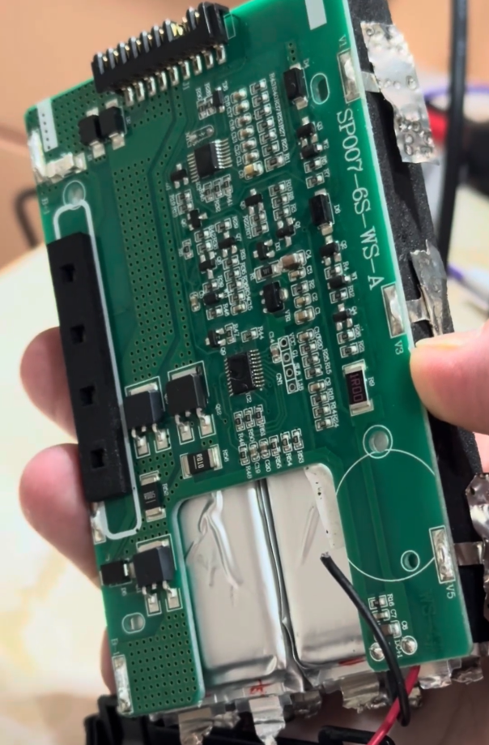

### 🧹 Süpürge PCB fotoğrafı

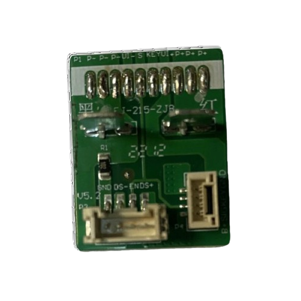

---

## 🧩 Konnektör Pin Dizilimi

10 pinli konnektör üzerinde yer alan pin isimleri:

P- | P- | P- | UI- | S | KEY | UI+ | P+ | P+ | P+

Ancak ilgili PCB'nin birebir aynı revizyona ait olduğu kesin olmadığı için
tüm pin fonksiyonları elektronik olarak doğrulanmıştır.

---

## 🔬 Elektriksel Doğrulama

Batarya ve süpürge konnektörleri jumper kablolar ile açığa alınmış,
cihaz çalışırken ölçümler gerçekleştirilmiştir.

### ⚡ Güç Hatları

- P- / P+ → Sürekli 24–25V DC  
  → Ana güç hattı olarak doğrulanmıştır.

### 🖥 UI Hatları

- UI- / UI+ → Yalnızca ekran aktifken 24–25V  
  → Ekran besleme hattı olarak değerlendirilmiştir.

### 🎯 KEY Hattı

- Tetik basılı → 24–25V  
- Tetik bırakıldığında → 0V  

→ Kullanıcı giriş hattı doğrulanmıştır.

### 📡 S Hattı

- Cihaz çalışırken → 24–25V genliğinde periyodik kare dalgalar  
- Cihaz kapalıyken → 0V sabit  

Bu davranış hattın communication line olduğunu güçlü şekilde göstermektedir.

---

### 🏷 Pin Mapping Etiketleme

Daha sonraki analiz çalışmalarında bağlantı hatalarını önlemek ve ölçüm
tekrar edilebilirliğini sağlamak amacıyla tespit edilen pin mapping,
hem batarya hem de süpürge konnektörü üzerinde fiziksel olarak etiketlenmiştir.

Bu sayede:

- Ölçüm noktaları standardize edilmiştir.
- Yanlış bağlantı riski minimize edilmiştir.
- Veri yakalama aşamasında referans karışıklığı önlenmiştir.

### 🔖 Etiketlenmiş Konnektör Görselleri

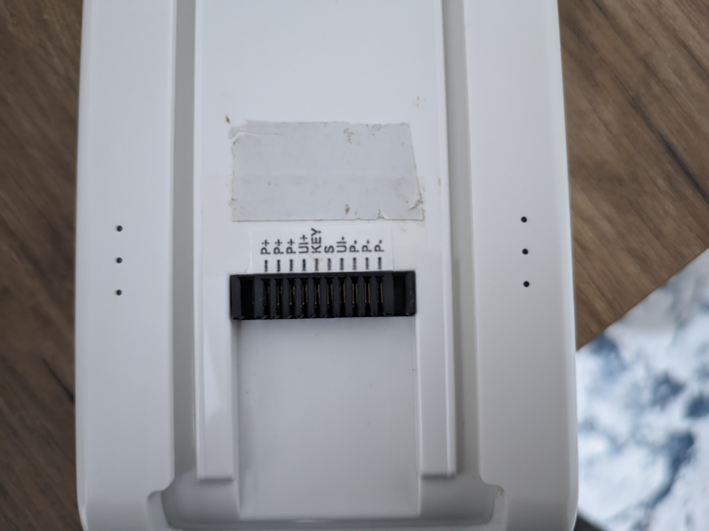 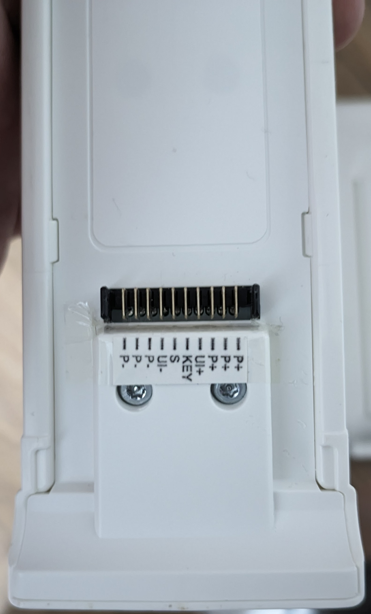

---

## 📌 Sonuç

- Güç hatları ayrıştırılmıştır.
- Kullanıcı giriş hattı doğrulanmıştır.
- Communication hattı tespit edilmiştir.
- Sinyal genliği ~24–25V olarak ölçülmüştür.

Logic seviyesi 24V olduğu için doğrudan logic analyzer bağlantısı mümkün değildir.
Bir sonraki aşamada uygun level shifting çözümü gereklidir.

# 2️⃣ Veri Yakalama ve Protokol Keşfi Denemeleri

Batarya konnektörü ve level shifter devresi kurulduktan sonra
S hattından jumper alınıp logic analyzer girişine bağlanmıştır.  
Hattın güvenli şekilde dinlenmesi sağlanmıştır.

---

## 🔍 İlk Analiz: 1-Wire Hipotezi

Hattın tek hatlı olması nedeniyle ilk olarak **1-Wire protokolü** varsayılmıştır.  

- Bazı anlamlı byte'lar gözlemlense de  
- Çok sayıda framing hatası ve korelasyonsuz byte dizileri mevcuttu  

Capture ve ekran görüntüleri:

[Capture Dosyası (Session 0.sal)](DOCUMENT/Session%200.sal)

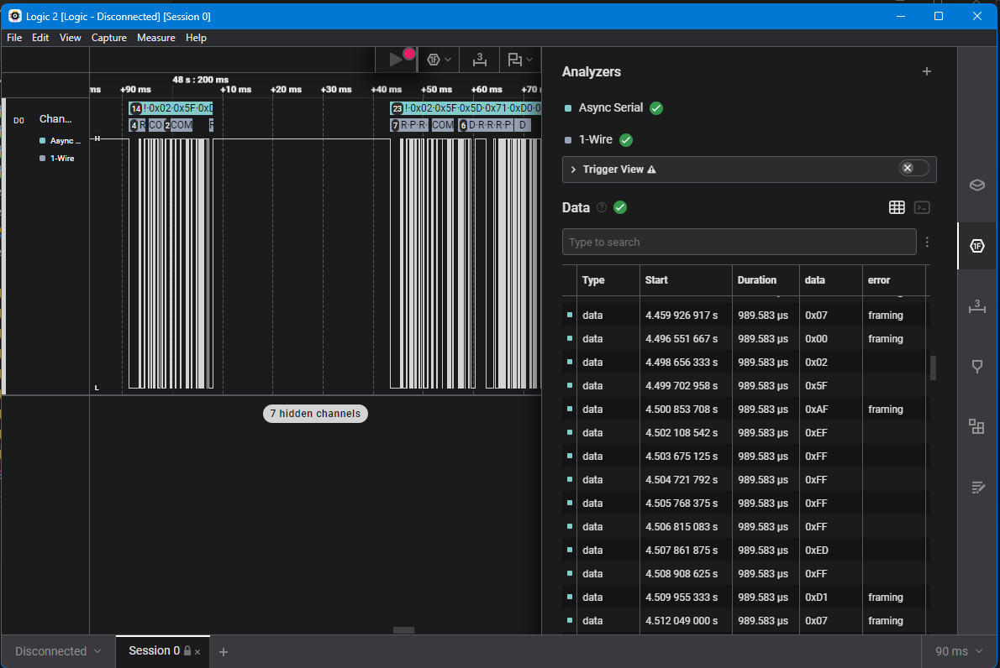

Bu gözlemler, hattın **standart 1-Wire protokolü olmadığı** ihtimalini güçlendirdi.

---

## ⚡ İkinci Analiz: Half-Duplex Single-Wire UART Hipotezi

Daha sonra hattın **half-duplex single-wire UART** olabileceği üzerine yoğunlaşıldı.  

- En yaygın standart baudrate değerlerinde sinyal analiz edildi  
- Hala çok sayıda framing hatası ve korelasyon gözlemlendi  

---

## ✅ Çözüm: Invert ve Doğru Parametreler

Son bir deneme olarak sinyal invert edilerek analiz edildi ve:

- **8N1 standardı**  
- **9600 baudrate**  
- **Inverted signal**

parametreleri ile **frameler tam olarak oturdu**.  


Capture ve ekran görüntüleri:

[Capture Dosyası (.sal)](DOCUMENT/Session%201.sal)  

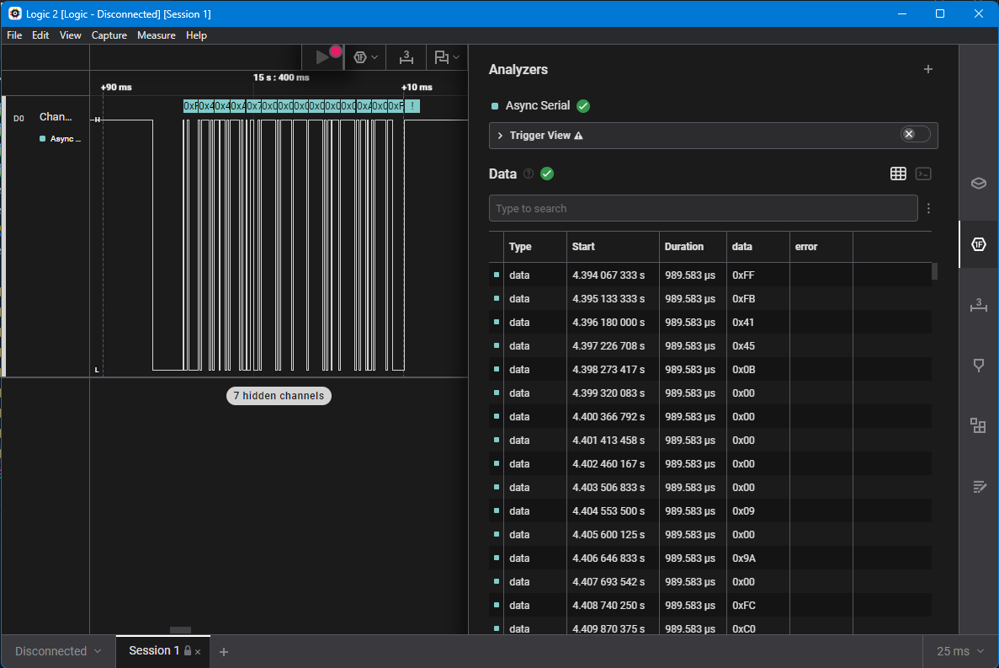 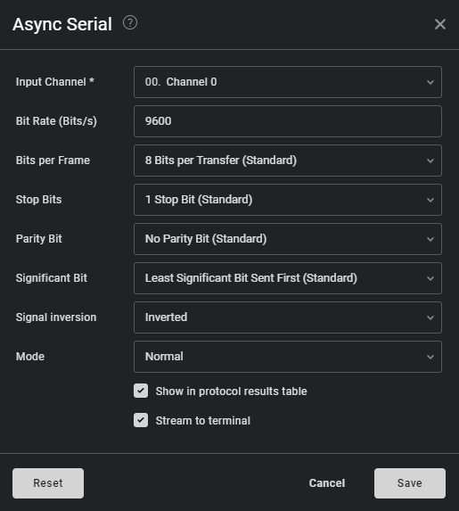

Byte dizileri artık **istikrarlı ve tekrar eden korelasyonlar** göstermeye başladı.  

## 🔄 Master/Slave Tespiti

Bit frameleri doğru şekilde yakalandıktan sonra, byte-level analiz ve
paket çözümlemesi için hangi tarafın master (sorgulayan) ve hangi tarafın
slave (cevaplayan) olduğunu belirlemek gerekiyordu.

Protokol tek hatlı olduğundan:

- Bir taraf sürekli dinlemede kalıyor  
- Diğer taraf sorgulama (polling) yapıyor  

Hangi tarafın master olduğunu anlamak için:

1. Haberleşme hattı geçici olarak kesildi  
2. Süpürge çalıştırıldı  
3. İlk konuşma denemesi her iki taraftan ayrı ayrı dinlendi  

### 📌 Sonuç

- **Master / Polling yapan taraf:** Süpürge  
- **Slave / Cevap veren taraf:** Batarya

Bu tespit, veri setinin doğru şekilde analiz edilmesini ve
sonraki aşama olan **alan tespiti / field identification** için sağlam bir temel sağlar.

## 📦 Paket Başlangıç ve Bitiş Condition’ları

Logic analyzer ile alınan byte akışı incelendiğinde, tekrarlı bir pattern gözlemlenmiştir:

- **0xFB** → Paket başlangıcı  
- **0xFC** → Paket sonu  

Dikkat çekici nokta:  
- 0xFB’den sonra 12 byte ileride 0xFC  
- 0xFC’den sonra 8 veya 9 byte sonra tekrar 0xFB  

Bu patternlerin paket başı ve paket sonu condition’ları olduğu varsayılmıştır.

---

## 📝 Excel Tablosuna Aktarım

Bu paket başı/sonu condition’larına göre, örnek bir konuşma akışı:

- Her 0xFB…0xFC paketi → Süpürgeden bataryaya  
- Her 0xFC…0xFB paketi → Bataryadan süpürgeye

Bu paketleri **satırlara ayırarak Excel tablosuna** döktüm.  
Henüz her byte’ın anlamını bilmiyor olsak da, tekrarlı alanlar gözlemlenebiliyordu.

- **Sarı arkaplanlı sütunlar** → Süpürgeden bataryaya giden paketler  
- **Mavi arkaplanlı sütunlar** → Bataryadan süpürgeye giden paketler

### 📊 Örnek Excel Görseli

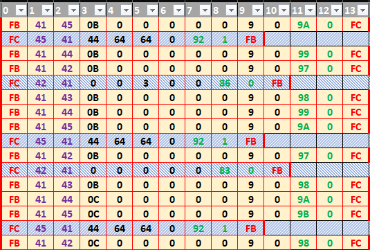

## 🔗 Paket İçi Korelasyon ve İlk Byte Analizi

Excel tablosunu dikkatle incelediğimizde bazı anlamlı korelasyonlar ortaya çıkmıştır:

Örnek bir süpürge → batarya paketi:

| Byte # |0    | 1   | 2  | 3  | 4 | 5| 6 | 7 | 8 | 9 | 10 | 11 | 12 | 13 |
|--------|-----|-----|----|---|---|---|---|---|---|----|----|----|----|----|
| Paket  | FB  | 41  | 45 | 0B| 00| 00| 00| 00| 00| 09 | 00 | 9A | 00 | FC |

Karşılık gelen batarya → süpürge paketi:

| Byte # |0    | 1   | 2   | 3  | 4  | 5  | 6  | 7  | 8  | 9  | 10 | 11 | 12 | 13 |
|--------|-----|-----|----|----|----|----|----|----|----|----|----|----|----|----|
| Paket  | FC  | 45  | 41 | 44 | 64 | 64 | 00 | 92 | 01 | FB |    |    |    |    |

### 📌 İlk Korelasyon Çıkarımı

- **1. byte (0x41)** → Kaynak ID (source ID)  
- **2. byte (0x45)** → Hedef ID (destination ID)  

Önce süpürgeden gelen pakette, ardından bataryadan gelen pakette bu değerlerin karşılıklı olarak eşleştiği gözlemlenmiştir.  

Bu korelasyon, **master/slave ve adresleme mekanizması** hakkında ilk ipuçlarını vermektedir.

### ✅ Checksum / Veri Bütünlüğü Doğrulama

İstisnasız her pakette geçerli olan **source/target ID korelasyonu** sayesinde
çözümlenmesi gereken **son 2 byte alanı** daha anlamlı hale gelmiştir.  

Çoğu seri haberleşme protokolünde olduğu gibi, G11 batarya protokolünde de
**checksum veya CRC benzeri bir veri bütünlüğü doğrulama alanı** vardır.

#### 🔹 İlk Varsayım

- Her paketin **son 2 byte’ı** checksum alanı olarak kabul edildi  
- Paket başı ve paket sonu condition’ları bu hesaba dahil edilmedi  
- Paket boyutu değişken olsa bile bu varsayım uygulanabilir

#### 🔹 Doğrulama

- Seçilen örnek paketler üzerinde **checksum hesaplaması** yapıldı  
- Hesaplama yöntemi:  checksum = SUM(paket başı/sonu durumları ve checksum alanı hariç tüm byte'lar)
- Tüm test edilen paketlerde hesaplanan checksum ile paket içindeki son 2 byte **tam olarak eşleşti**  

#### 📊 Örnek Paket ve Checksum

| Paket (süpürge → batarya) | Byte 0 | Byte 1 | … | Byte n-2(Checksum_L) | Byte n-1(Checksum_H) | Byte n |
|----------------------------|--------|--------|---|----------|----------|--------|
| Örnek 1                   | 0xFB   | 0x41   | … | 0x9A     | 0x00     | 0xFC   |

Hesaplanan Checksum        0x41+0x45+0x0B+0x09=0x009A

> Son 2 byte paket içindeki checksum ile tam olarak eşleşmektedir.

### 📊 Tüm Paketler Üzerinde Checksum Doğrulama

Tek paket üzerinden yapılan denemeler yeterli kanıt sağlamadığından,
checksum doğrulamasını **tüm veri setine** uyguladım:

- Excel tablosunda, paket başı ve paket sonu condition’ları dikkate alınmadan
  her paketin son 2 byte’ının checksum olduğu varsayıldı  
- Paket içerisindeki **checksum alanı** ile **hesaplanan checksum** karşılaştırıldı  
- Bu karşılaştırmayı otomatik yapan **formüllü bir sütun** oluşturuldu

#### 🔹 Sonuç

- Toplam ~6500 paket üzerinde doğrulama yapıldı  
- Tek bir paket bile formül doğrulamasını ihlal etmedi  

> Bu sayede, checksum alanı kesin olarak doğrulanmış oldu.

#### 🧮 Checksum Hesaplama

Aşağıdaki formül, paket tipine göre hangi byte’ların checksum’a dahil edileceğini belirler ve checksum'u hesaplar:

```
=EĞER([@1]=41;
    DEC2HEX(TOPLA(HEX2DEC([@1]);HEX2DEC([@2]);HEX2DEC([@3]);HEX2DEC([@4]);HEX2DEC([@5]);HEX2DEC([@6]);HEX2DEC([@7]);HEX2DEC([@8]);HEX2DEC([@9]);HEX2DEC([@10]));4);
EĞER([@1]=45;
    DEC2HEX(TOPLA(HEX2DEC([@1]);HEX2DEC([@2]);HEX2DEC([@3]);HEX2DEC([@4]);HEX2DEC([@5]);HEX2DEC([@6]));4);
EĞER([@1]=42;
    DEC2HEX(TOPLA(HEX2DEC([@1]);HEX2DEC([@2]);HEX2DEC([@3]);HEX2DEC([@4]);HEX2DEC([@5]);HEX2DEC([@6]);HEX2DEC([@7]));4)
)))
```
Checksum OK? Sutünündaki bu formülde hesaplanan checksum ile checksum alanındaki değerin eşit olup olmama duruma göre OK veya ERRROR döndürür

```
=EĞER([@Checksum]=
EĞER([@1]=41;
  DEC2HEX(BİTVEYA(BİTSOLAKAYDIR(HEX2DEC([@12]);8);HEX2DEC([@11]));4);
EĞER([@1]=45;
  DEC2HEX(BİTVEYA(BİTSOLAKAYDIR(HEX2DEC([@8]);8);HEX2DEC([@7]));4);
EĞER([@1]=42;
  DEC2HEX(BİTVEYA(BİTSOLAKAYDIR(HEX2DEC([@9]);8);HEX2DEC([@8]));4);0
)));"OK";"ERROR")
```

#### 📷 Excel Checksum Alanı Doğrulama Görseli


# 3️⃣ Alan Tespiti (Payload Analizi)

Payload içindeki alanları belirlemek için yaklaşık **4 dakikalık bir kullanım senaryosu** hazırlandı.  
Senaryoda hangi anda hangi işlemin yapıldığı tabloya döküldü:

| Zaman    | Olay                                           |
|----------|-----------------------------------------------|
| 00:04:00 | Açılış                                        |
| 00:07:00 | Mod Değişimi: AUTO → TURBO                    |
| 00:11:00 | Mod Değişimi: TURBO → ECO                     |
| 00:13:00 | Tetiğe basma – motoru çalıştırma (ECO)       |
| 00:20:00 | Tetiği bırakma – motoru durdurma (ECO)       |
| 00:21:00 | Tetiğe basma – motoru çalıştırma (ECO)       |
| 00:27:00 | Tetiği bırakma – motoru durdurma (ECO)       |
| 00:29:00 | Mod Değişimi: ECO → AUTO                      |
| 00:30:00 | Tetiğe basma – motoru çalıştırma (AUTO)      |
| 00:36:00 | Tetiği bırakma – motoru durdurma (AUTO)      |
| 00:38:00 | Tetiğe basma – motoru çalıştırma (AUTO)      |
| 00:42:00 | Tetiği bırakma – motoru durdurma (AUTO)      |
| 00:43:00 | Mod Değişimi: AUTO → TURBO                    |
| 00:45:00 | Tetiğe basma – motoru çalıştırma (TURBO)     |
| 00:52:00 | Tetiği bırakma – motoru durdurma (TURBO)     |
| 00:53:00 | Tetiğe basma – motoru çalıştırma (TURBO)     |
| 01:04:00 | Tetiği bırakma – motoru durdurma (TURBO)     |
| 01:05:00 | Tetik kilidi aktif                             |
| 01:08:00 | Tetiğe basma – motoru çalıştırma (TURBO)     |
| 01:08:00 | Tetiği bırakma                                 |
| 01:15:00 | Vakumu tıkama                                 |
| 01:16:00 | Vakumu açma                                   |
| 01:17:00 | Vakumu tıkama                                 |
| 01:18:00 | Vakumu açma                                   |
| 03:03:00 | Tetiğe basma – motoru durdurma (TURBO)       |
| 03:04:00 | Tetiği bırakma                                 |
| 03:06:00 | Tetiğe basma – motoru çalıştırma (TURBO)     |
| 03:06:00 | Tetiği bırakma                                 |
| 03:25:00 | Mod Değişimi: TURBO → ECO                     |
| 03:29:00 | Mod Değişimi: ECO → AUTO                      |
| 03:31:00 | Mod Değişimi: AUTO → TURBO                     |
| 03:34:00 | Mod Değişimi: TURBO → ECO                     |
| 03:40:00 | Tetiğe basma – motoru durdurma (TURBO)       |
| 03:40:00 | Tetiği bırakma                                 |
| 03:47:00 | Şarj aleti takma (%63)                        |
| 03:52:00 | Şarj aleti çıkarma (%63)                      |
| 03:56:00 | SON                                           |

---

## 📊 Payload Korelasyonu ve Battery Level

- Kullanım senaryosu sırasında **logic analyzer** ile aynı anda veri capture edildi.  
- Excel tablosuna paketler aktarıldı, önceki formüller ve sütunlar kullanıldı.  
- Süpürgenin ekranında **batarya şarj seviyesi** canlı olarak gösteriliyor, dolayısıyla bataryadan gelen paketlerde bir **Battery Level** alanı olması gerektiği varsayıldı.  

### 🔹 Battery Level Alanı Tespiti

- Bataryadan süpürgeye gönderilen paketler (0xFC ile başlar, 0xFB ile biter) filtrelendi.  
- Kaynak ID’si **0x45** olan paketlerin **4. byte’ı** zamanla düşen trend gösterdi:  
  - Başlangıçta decimal 100  
  - Kullanım senaryosunun sonunda decimal 63  
- Bu byte **Battery Level (%)** olarak işaretlendi.  

#### 🔹 Excel Formülü ve Görsel

- Tüm paketlerde 4. byte üzerinden **Battery Level** hesaplayan sütun eklendi.  
- Zaman ekseninde grafiği çizildi:

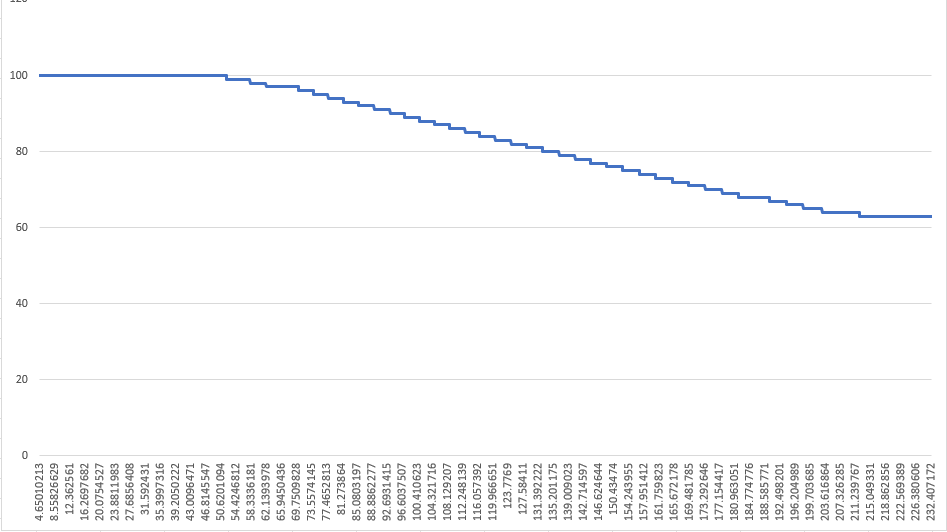

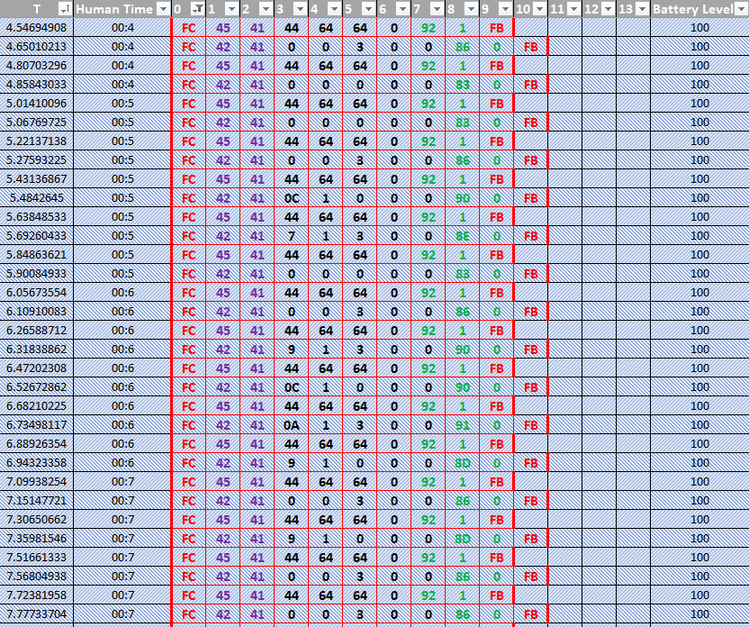 

### 🔹 Charger Status Alanı Tespiti

Batarya tarafında alınması gereken bir diğer veri **şarj aleti takılma durumu**dur.  
- Süpürge ekranında anlık olarak gösterildiği için bataryadan gelen paketlerde bu bilgiyi içeren bir alan olmalıydı.  
- Kullanım senaryosunda şarj aleti takma/çıkarma anlarına karşılık gelen **byte ve bit** arandı:  
  - Kaynak ID: **0x45**  
  - Byte: **3. byte**  
  - Bit: **3. bit** (bit pozisyonları 0’dan başlıyor kabul edilmiştir)  

Bu bitin durumu **1 → şarj aleti takılı**, **0 → şarj aleti çıkarıldı** olarak değerlendirildi.  

- Excel tablosuna yeni bir sütun eklenerek tüm paketler için bu bitin durumu hesaplandı.  
- Sonuçlar kullanım senaryosundaki olaylarla birebir uyumlu çıktı.  

#### 🔖 Charger Status Görseli

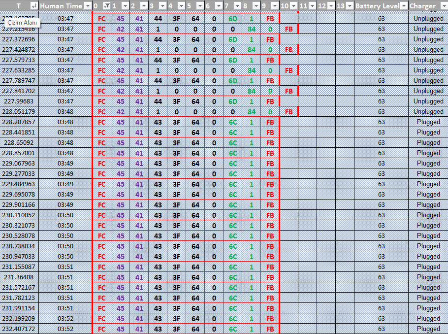

### 🔹 Güç Modu ve Motor Gücü Alanı Analizi

Kullanım senaryosunda süpürge, kasıtlı olarak **güç modları arasında geçişler** yaptı, durdurulup tekrar çalıştırıldı ve bazı anlarda tıkama ile kısa süreli zorlandı.  
Amaç: protokoldeki aynı ana denk gelen paketlerdeki değişimleri analiz etmek.

- Süpürge **3 güç kademesi** içeriyor: düşük → orta → yüksek  
- Mod değişimlerinde **motor devri, motor voltajı ve akım**da değişim bekleniyor  

#### 0x45 Kaynak ID’li Paket

- Bu pakette **temsil edilemeyen 2 byte** kaldı, bu değerlerin BMS hata/durum bayrakları olduğu varsayıldı şuan batarya sağlam olup bu durumlar oluşturlamayacağı için mevcut analiz kapsamında pas geçildi.

#### 0x42 Kaynak ID’li Paket

- Henüz keşfedilmeyi bekleyen **5 byte’lık payload alanı** mevcut  
- Analiz için **3. ve 4. byte concat edilerek 16-bit sayısal değer** hesaplandı  
- Tüm 0x42 paketleri filtrelendi ve Excel tablosuna eklenerek çizgi grafiği oluşturuldu  

#### 🔎 Sonuç

- Grafikte yaklaşık **45. saniyede 500 değerine ulaşan pikler** gözlendi  
- Öncesi ve sonrası, süpürge çalıştırma/durdurma ve tıkama/anındaki dalgalanmalarla uyumlu  
- Cihazın speklerinden süpürgenin **500W güçte** olduğu biliniyor  
- Tüm bu bulgular, söz konusu **16-bit alanın Watt cinsinden güç tüketimi** bilgisini temsil ettiğini %99 ihtimalle doğruluyor  

### 🔖 Power Consumption Grafiği

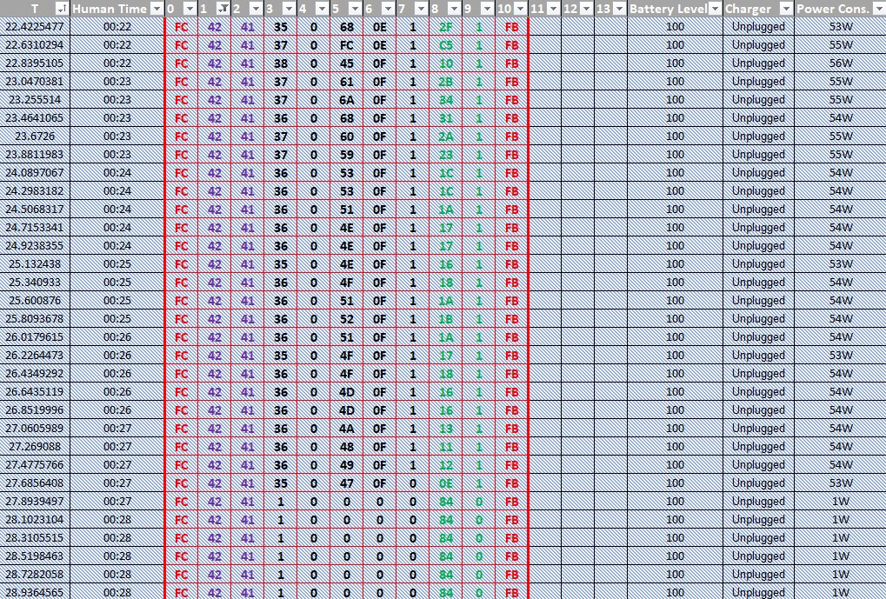 c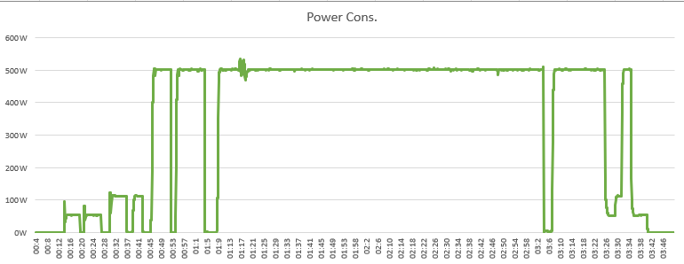

### 🔧 Akım (Current) Alanının Tespiti

- 0x42 kaynak ID’li paketlerdeki 5. ve 6. byte’lar concat edilerek 16-bit’lik bir sütun oluşturuldu.  
- Bu sütunun çizgi grafiği çıkarıldı ve analiz edildi.

Grafiğe bakıldığında:  

- Tıkama anında bariz pikler gözlemlendi
- Bir elektrik motorunun davranışına göre mantıklı: motor zorlandığında çektiği akım artar.  
- Bu durum grafikte açıkça gözleniyor.  
- Değerler cihazın nominal gücüyle kıyaslandığında biraz düşük görünüyor, bu nedenle birim kesin değil; muhtemelen raw ADC değeri veya motor tahmin ettiğimden daha yüksek gerilimle çalışıyor bu durumda Amper birimi mantıklı olabilir.  
- Tıkama ve mod geçişleri sırasında paternler uygun → bu alanın **akım (current)** verisi olduğuna karar verildi.

### 🔖 Current Grafiği

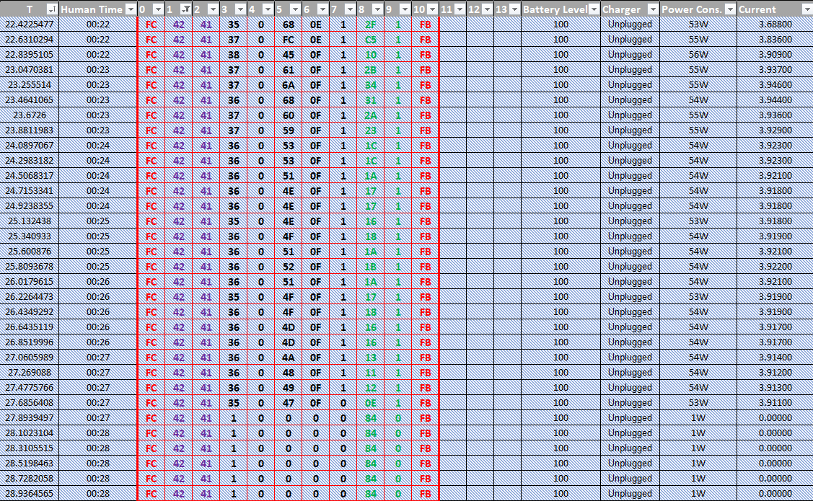 c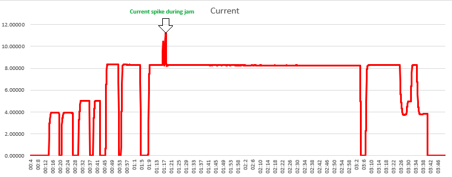

### 🔌 Voltaj (Voltage) Türetimi ve Akım Alanının Doğrulanması

Akım ve güç verilerini daha iyi anlamak ve akım alanındaki tespitimizi desteklemek için:

- Türetilmiş bir **voltaj sütunu** oluşturuldu:  
  - Formül: \( P = V x I \)  
  - Güç sütunları, akım (varsayılan) sütunlarına bölünerek hesaplandı.
- Oluşturulan voltaj sütununun çizgi grafiği çıkarıldı.

Grafik analizinde:

- **Tıkama anında voltaj düşümleri** gözlemlendi → elektrik motorlarının yük altında voltaj düşmesi beklenen bir davranış.
- **Motorun sıfır hızdan kalkış anlarında voltaj peakleri** mantıklı ve elektrik motorlarının karakteristiği ile uyumlu.
- Bu gözlemler, daha önce belirlenen **akım ve güç alanlarının kendi içinde tutarlı olduğunu** destekliyor.
- Sonuç: Akım alanı tespitinde güven biraz daha arttı.

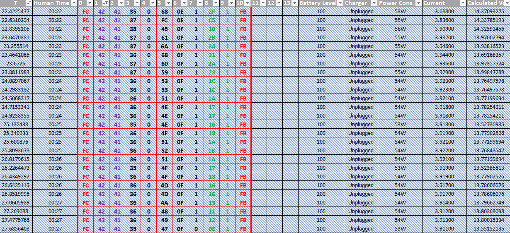 c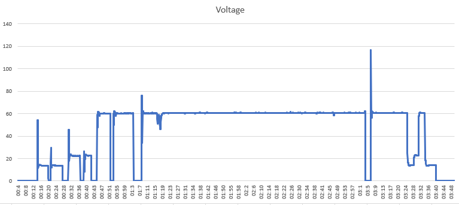

### 🔹 Motor Aktif/Deaktif Durumu (Motor Status)

0x42 kaynak ID'li paket üzerinde **yalnızca 7. byte** tespit edilememişti.  

- Bu byte incelendiğinde:
  - Motor çalışırken → 1  
  - Motor dururken → 0  

- Gözlemlerde bu davranış tüm kullanım senaryosu boyunca tutarlıydı.  
- Bu nedenle, **grafik oluşturmaya gerek kalmadan** bu byte doğrudan **Motor Aktif/Deaktif (Motor Status)** olarak işaretlendi.

## 🔹 Süpürge Paketleri: 0x41 Kaynak ID

Süpürgeden gelen **tek paket tipi** 0x41 kaynak ID’li paket incelenmiştir.  

- Tüm veri seti boyunca değişen alanlar:  3, 4, 5 ve 6. byte'lar.

      6. byte yalnızca 0 ve 1 değerleri alabildiği için şimdilik sonraya bırakılmıştır

### 🔹 3. 4. ve 5. Byte – Motor Devri / Commanded Velocity

- 3. 4. ve 5. byte concat edilerek 24 bitlik değer hesaplanmıştır.  
- Grafikte minimum: 0, maksimum: 128000 değerleri gözlemlenmiştir.  
- Akım ve güç grafiklerinde pattern ile uyum gözlemlenmiştir.

> Bu değerler, bu alanın motor devri olduğunu düşündürmüştür, çünkü 128000 RPM gibi bir değer bir vakum motoru için olması gereken yüksek devirdir.  
> Ancak grafiğin bu kadar stabil olması ve akım ile güç alanlarındaki dalgalanmaların görülmemesi, bunun bir **actual velocity** olmadığını, yalnızca **motor sürücüye gönderilen commanded velocity** değeri olduğunu düşündürmektedir.

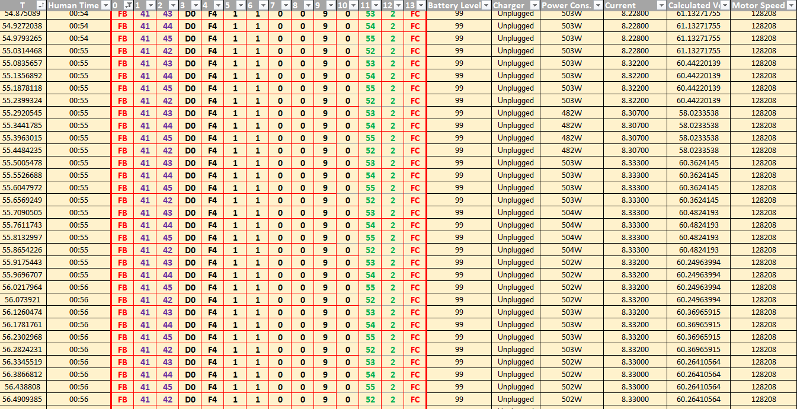 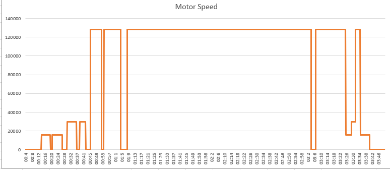

#### 🔹 6. Byte – Mod Bayrağı & Tetik Durumu

- **6. byte**: Tamamen **tetik basma / bırakma durumlarını** göstermektedir.  
  → 4 dakikalık kullanım senaryosunda tüm değişiklikler doğrulanmıştır.  

Diğer byte’larda kullanım senaryosu boyunca hiçbir değişiklik gözlemlenmemiştir.

---

## 📊 Özet – Çözülen Paket Alanları

| Kaynak ID | Paket Başlangıç | Paket Bitiş | Alan | Açıklama |
|-----------|----------------|-------------|------|----------|
| 0x45      | 0xFC           | 0xFB        | 3.bit (byte 3) | Şarj aleti takılma durumu (flag) |
|           |                |             | 4.byte        | Şarj yüzdesi (%) |
|           |                |             | 5-6.byte      | BMS hata / durum alanları (belirsiz) |
| 0x42      | 0xFC           | 0xFB        | 3-4.byte concat | Güç tüketimi (Watt) |
|           |                |             | 5-6.byte concat | Akım (A) / muhtemelen raw ADC değeri |
|           |                |             | 7.byte        | Motor aktif / deaktif durumu |
| 0x41      | 0xFB           | 0xFC        | 3-4.byte concat | Motor devri / Commanded Velocity |
|           |                |             | 5.byte        | Turbo mod bayrağı / koruma flag |
|           |                |             | 6.byte        | Tetik basma / bırakma durumu |

