# Language Selection
[English](README-en.md) | [Türkçe](README.md)

# 🔋 G11 Battery Protocol Emulation

## 📌 Projenin Amacı

Bu proje, akıllı bir batarya ile cihaz arasındaki haberleşme protokolünün
tersine mühendislik (reverse engineering) yöntemiyle analiz edilmesi ve gömülü sistem üzerinde
yeniden modellenmesini konu almaktadır.

Amaç:

- Kapalı bir sistemin haberleşme davranışını analiz etmek
- Paket yapısını çözümlemek
- Doğrulama mekanizmalarını anlamak
- Elde edilen verilerle protokol seviyesinde emülasyon geliştirmek

Bu çalışma, planlı eskitme tartışmalarına teknik bir perspektiften yaklaşır.
Bir sistemi gerçekten anlamanın yolu, onu yeniden inşa edebilmekten geçer.

---

## 🔬 Çalışma Süreci

Bu proje aşağıdaki deterministik mühendislik adımlarını takip etmiştir:

<details>
<summary><strong>1️⃣ Arayüz Karakterizasyonu</strong></summary>

Batarya paketi ve süpürge gövdesi açılmadan analiz yapılması hedeflenmiştir.
Bu nedenle konnektör pin fonksiyonları dolaylı ve müdahalesiz (non-invasive) yöntemlerle
tespit edilmiştir.

## 📷 Referans PCB Görselleri

Model yeni olduğu için teardown materyali sınırlıdır.

Yapılan araştırmalar sonucunda:

- Batarya PCB görüntüsüne bir video incelemesinde,
- Süpürge tarafındaki PCB görüntüsüne çevrim içi bir yedek parça platformunda

ulaşılmıştır.

> Batarya PCB’sinde pin fonksiyonlarına dair işaretleme bulunmamaktadır.  
> Süpürge tarafındaki PCB üzerinde konnektör pin isimleri etiketlenmiştir.

📌 Referans Görseller:

### 🔋 Batarya PCB fotoğrafı

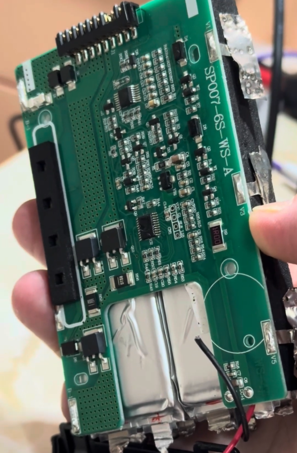

### 🧹 Süpürge PCB fotoğrafı

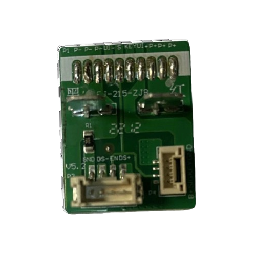

---

## 🧩 Konnektör Pin Dizilimi

10 pinli konnektör üzerinde yer alan pin isimleri:

P- | P- | P- | UI- | S | KEY | UI+ | P+ | P+ | P+

Ancak ilgili PCB'nin birebir aynı revizyona ait olduğu kesin olmadığı için
tüm pin fonksiyonları elektronik olarak doğrulanmıştır.

---

## 🔬 Elektriksel Doğrulama

Batarya ve süpürge konnektörleri jumper kablolar ile açığa alınmış,
cihaz çalışırken ölçümler gerçekleştirilmiştir.

### ⚡ Güç Hatları

- P- / P+ → Sürekli 24–25V DC  
  → Ana güç hattı olarak doğrulanmıştır.

### 🖥 UI Hatları

- UI- / UI+ → Yalnızca ekran aktifken 24–25V  
  → Ekran besleme hattı olarak değerlendirilmiştir.

### 🎯 KEY Hattı

- Tetik basılı → 24–25V  
- Tetik bırakıldığında → 0V  

→ Kullanıcı giriş hattı doğrulanmıştır.

### 📡 S Hattı

- Cihaz çalışırken → 24–25V genliğinde periyodik kare dalgalar  
- Cihaz kapalıyken → 0V sabit  

Bu davranış, hattın haberleşme hattı olduğunu güçlü şekilde göstermektedir.

---

### 🏷 Pin Eşlemesinin Etiketlenmesi

Daha sonraki analiz çalışmalarında bağlantı hatalarını önlemek ve ölçüm
tekrar edilebilirliğini sağlamak amacıyla tespit edilen pin eşlemesi,
hem batarya hem de süpürge konnektörü üzerinde fiziksel olarak etiketlenmiştir.

Bu sayede:

- Ölçüm noktaları standardize edilmiştir.
- Yanlış bağlantı riski minimize edilmiştir.
- Veri yakalama aşamasında referans karışıklığı önlenmiştir.

### 🔖 Etiketlenmiş Konnektör Görselleri

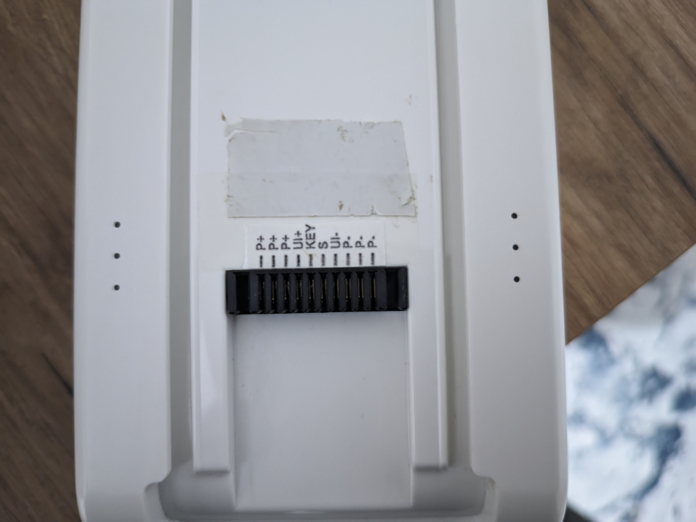 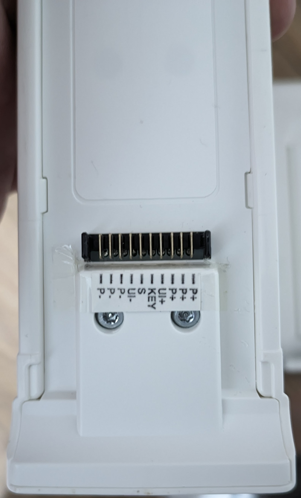

---

## 📌 Sonuç

- Güç hatları ayrıştırılmıştır.
- Kullanıcı giriş hattı doğrulanmıştır.
- Haberleşme hattı tespit edilmiştir.
- Sinyal genliği ~24–25V olarak ölçülmüştür.

Logic seviyesi 24V olduğu için doğrudan logic analyzer bağlantısı mümkün değildir.
Bir sonraki aşamada uygun level shifting çözümü gereklidir.
</details>
<details>
<summary><strong>2️⃣ Veri Yakalama ve Protokol Keşfi Denemeleri</strong></summary>

### 🔹 Seviye Dönüştürücü (Level Shifter) Görselleri

#### 1. Delikli Pertinaks Üzerinde Yapılmış Devre
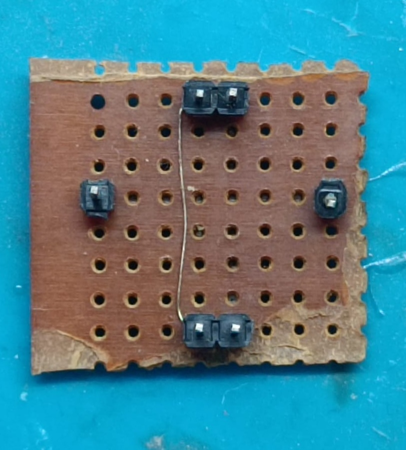 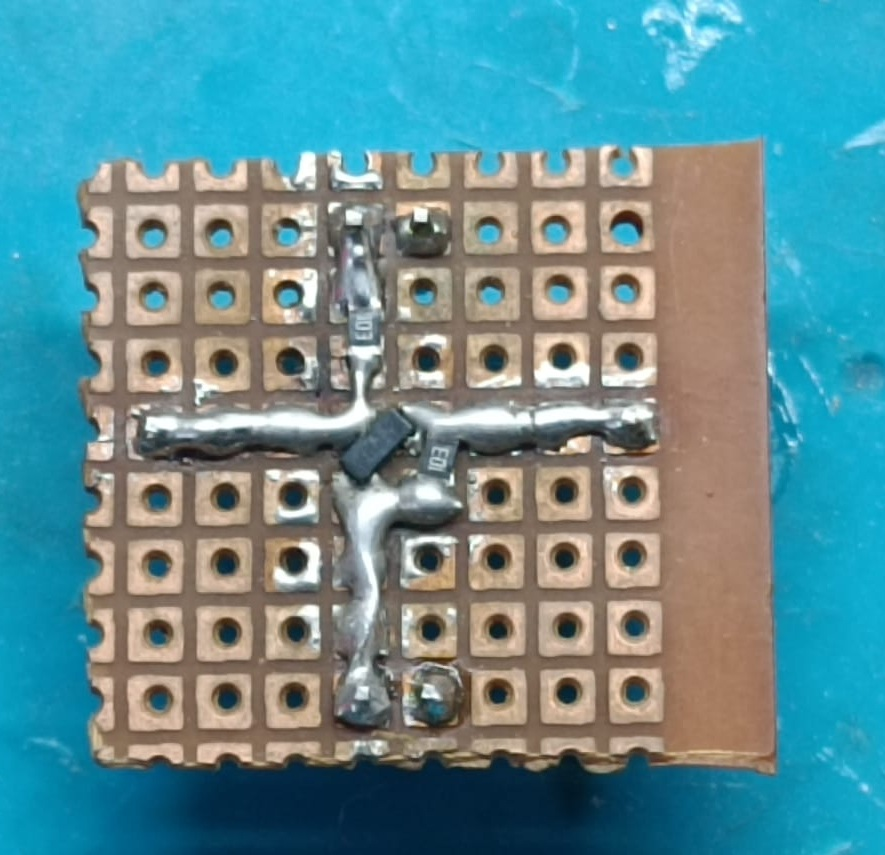

#### 2. Şematik Görseli
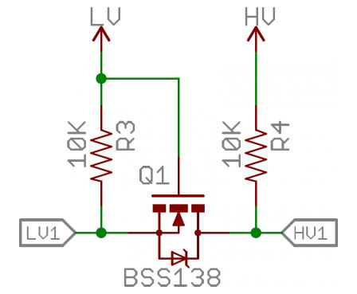

Batarya konnektörü ve level shifter devresi kurulduktan sonra
S hattından jumper alınıp lojik analizör girişine bağlanmıştır.  
Hattın güvenli şekilde dinlenmesi sağlanmıştır.

---

## 🔍 İlk Analiz: 1-Wire Hipotezi

Hattın tek hatlı olması nedeniyle ilk olarak **1-Wire protokolü** varsayılmıştır.  

- Bazı anlamlı byte'lar gözlemlense de  
- Çok sayıda framing hatası ve korelasyonsuz byte dizileri mevcuttu  

Veri kaydı ve ekran görüntüleri:

[Capture Dosyası (Session 0.sal)](DOCUMENT/Session%200.sal)

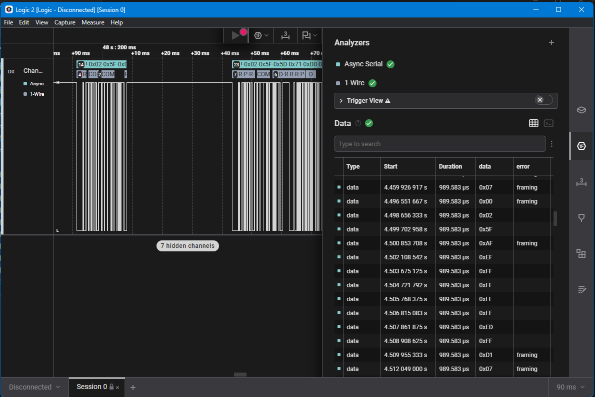

Bu gözlemler, hattın **standart 1-Wire protokolü olmadığı** ihtimalini güçlendirdi.

---

## ⚡ İkinci Analiz: Half-Duplex Single-Wire UART Hipotezi

Daha sonra hattın **half-duplex single-wire UART** olabileceği üzerine yoğunlaşıldı.  

- En yaygın standart baud hızlarında sinyal analiz edildi  
- Hâlâ çok sayıda çerçeveleme (framing) hatası vardı ve korelasyon gözlemlenmedi  

---

## ✅ Çözüm: Sinyalin Terslenmesi ve Doğru Parametreler

Son bir deneme olarak sinyal terslenerek analiz edildi ve:

- **8N1 standardı**  
- **9600 baud**  
- **Inverted signal**

parametreleriyle **çerçeveler (frame) tam olarak oturdu**.  


Veri kaydı ve ekran görüntüleri:

[Capture Dosyası (Session 1.sal)](DOCUMENT/Session%201.sal)  

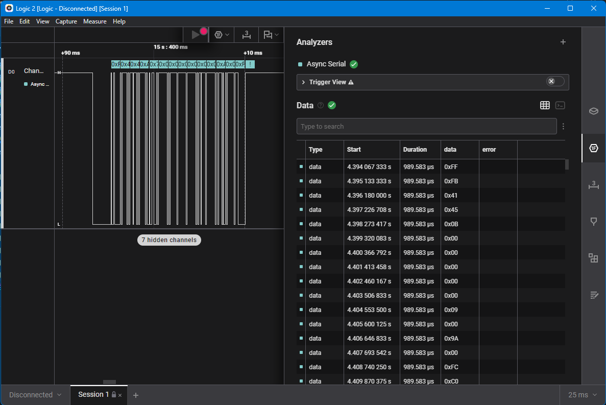 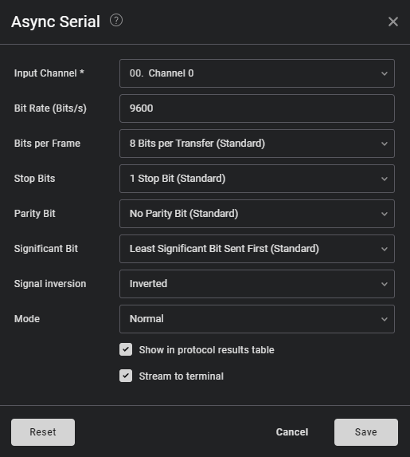

Byte dizileri artık **istikrarlı ve tekrar eden korelasyonlar** göstermeye başladı.  

## 🔄 Master/Slave Tespiti

Bit çerçeveleri doğru şekilde yakalandıktan sonra, byte seviyesinde analiz ve
paket çözümlemesi için hangi tarafın master (sorgulayan) ve hangi tarafın
slave (cevaplayan) olduğunu belirlemek gerekiyordu.

Protokol tek hatlı olduğundan:

- Bir taraf sürekli dinlemede kalıyor  
- Diğer taraf sorgulama (polling) yapıyor  

Hangi tarafın master olduğunu anlamak için:

1. Haberleşme hattı geçici olarak kesildi  
2. Süpürge çalıştırıldı  
3. İlk konuşma denemesi her iki taraftan ayrı ayrı dinlendi  

### 📌 Sonuç

- **Master / Polling yapan taraf:** Süpürge  
- **Slave / Cevap veren taraf:** Batarya

Bu tespit, veri setinin doğru şekilde analiz edilmesini ve
sonraki aşama olan **alan tespiti (field identification)** için sağlam bir temel sağlamıştır.

## 📦 Paket Başlangıç ve Bitiş Koşulları

Lojik analizör ile alınan byte akışı incelendiğinde, tekrarlayan bir örüntü gözlemlenmiştir:

- **0xFB** → Paket başlangıcı  
- **0xFC** → Paket sonu  

Dikkat çekici nokta:  
- 0xFB’den sonra 12 byte ileride 0xFC  
- 0xFC’den sonra 8 veya 9 byte sonra tekrar 0xFB  

Bu örüntülerin paket başlangıç ve bitiş sınırlarını temsil ettiği varsayılmıştır.

---

## 📝 Excel Tablosuna Aktarım

Bu paket başlangıç/bitiş koşullarına göre, örnek bir konuşma akışı:

- Her 0xFB…0xFC paketi → Süpürgeden bataryaya  
- Her 0xFC…0xFB paketi → Bataryadan süpürgeye

Bu paketleri **satırlara ayırarak Excel tablosuna** döktüm.  
Henüz her byte’ın anlamını bilmiyor olsak da, tekrarlı alanlar gözlemlenebiliyordu.

- **Sarı arka planlı satırlar** → Süpürgeden bataryaya giden paketler  
- **Mavi arka planlı satırlar** → Bataryadan süpürgeye giden paketler

### 📊 Örnek [Excel](DOCUMENT/G11_protocol_analyze.xlsx) Görseli

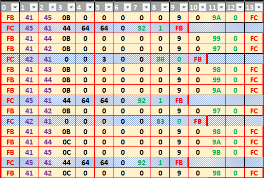

## 🔗 Paket İçi Korelasyon ve İlk Byte Analizi

Excel tablosunu dikkatle incelediğimizde bazı anlamlı korelasyonlar ortaya çıkmıştır:

Örnek bir süpürge → batarya paketi:

| Byte # |0    | 1   | 2  | 3  | 4 | 5| 6 | 7 | 8 | 9 | 10 | 11 | 12 | 13 |
|--------|-----|-----|----|---|---|---|---|---|---|----|----|----|----|----|
| Paket  | FB  | 41  | 45 | 0B| 00| 00| 00| 00| 00| 09 | 00 | 9A | 00 | FC |

Karşılık gelen batarya → süpürge paketi:

| Byte # |0    | 1   | 2   | 3  | 4  | 5  | 6  | 7  | 8  | 9  | 10 | 11 | 12 | 13 |
|--------|-----|-----|----|----|----|----|----|----|----|----|----|----|----|----|
| Paket  | FC  | 45  | 41 | 44 | 64 | 64 | 00 | 92 | 01 | FB |    |    |    |    |

### 📌 İlk Korelasyon Çıkarımı

- **Byte 1 (0x41)** → Kaynak ID (source ID)  
- **Byte 2 (0x45)** → Hedef ID (destination ID)  

Önce süpürgeden gelen pakette, ardından bataryadan gelen pakette bu değerlerin karşılıklı olarak eşleştiği gözlemlenmiştir.  

Bu korelasyon, **master/slave ve adresleme mekanizması** hakkında ilk ipuçlarını vermektedir.

### ✅ Checksum / Veri Bütünlüğü Doğrulama

İstisnasız her pakette geçerli olan **source/target ID korelasyonu** sayesinde
çözümlenmesi gereken **son 2 byte alanı** daha anlamlı hale gelmiştir.  

Çoğu seri haberleşme protokolünde olduğu gibi, G11 batarya protokolünde de
**checksum veya CRC benzeri bir veri bütünlüğü doğrulama alanı** vardır.

#### 🔹 İlk Varsayım

- Her paketin **son 2 byte’ı** checksum alanı olarak kabul edildi  
- Paket başlangıç ve bitiş byte'ları bu hesaba dahil edilmedi  
- Paket boyutu değişken olsa bile bu varsayım uygulanabilir

#### 🔹 Doğrulama

- Seçilen örnek paketler üzerinde **checksum hesaplaması** yapıldı  
- Hesaplama yöntemi:  checksum = SUM(paket başlangıç/bitiş byte'ları ve checksum alanı hariç tüm byte'lar)
- Tüm test edilen paketlerde hesaplanan checksum ile paket içindeki son 2 byte **tam olarak eşleşti**  

#### 📊 Örnek Paket ve Checksum

| Paket (süpürge → batarya) | Byte 0 | Byte 1 | … | Byte n-2(Checksum_L) | Byte n-1(Checksum_H) | Byte n |
|----------------------------|--------|--------|---|----------|----------|--------|
| Örnek 1                   | 0xFB   | 0x41   | … | 0x9A     | 0x00     | 0xFC   |

Hesaplanan Checksum        0x41+0x45+0x0B+0x09=0x009A

> Son 2 byte paket içindeki checksum ile tam olarak eşleşmektedir.

### 📊 Tüm Paketler Üzerinde Checksum Doğrulama

Tek paket üzerinden yapılan denemeler yeterli kanıt sağlamadığından,
checksum doğrulamasını **tüm veri setine** uyguladım:

- Excel tablosunda, paket başlangıç ve bitiş byte'ları dikkate alınmadan
  her paketin son 2 byte’ının checksum olduğu varsayıldı  
- Paket içerisindeki **checksum alanı** ile **hesaplanan checksum** karşılaştırıldı  
- Bu karşılaştırmayı otomatik yapan **formüllü bir sütun** oluşturuldu

#### 🔹 Sonuç

- Toplam ~6500 paket üzerinde doğrulama yapıldı  
- Tek bir paket bile formül doğrulamasını ihlal etmedi  

> Böylece checksum alanı, yaklaşık 6500 paketlik veri setinin tamamında doğrulanmıştır.

#### 🧮 Checksum Hesaplama

Aşağıdaki formül, paket tipine göre hangi byte’ların checksum’a dahil edileceğini belirler ve checksum'u hesaplar:

```
=EĞER([@1]=41;
    DEC2HEX(TOPLA(HEX2DEC([@1]);HEX2DEC([@2]);HEX2DEC([@3]);HEX2DEC([@4]);HEX2DEC([@5]);HEX2DEC([@6]);HEX2DEC([@7]);HEX2DEC([@8]);HEX2DEC([@9]);HEX2DEC([@10]));4);
EĞER([@1]=45;
    DEC2HEX(TOPLA(HEX2DEC([@1]);HEX2DEC([@2]);HEX2DEC([@3]);HEX2DEC([@4]);HEX2DEC([@5]);HEX2DEC([@6]));4);
EĞER([@1]=42;
    DEC2HEX(TOPLA(HEX2DEC([@1]);HEX2DEC([@2]);HEX2DEC([@3]);HEX2DEC([@4]);HEX2DEC([@5]);HEX2DEC([@6]);HEX2DEC([@7]));4)
)))
```
**Checksum OK?** sütunundaki bu formül, hesaplanan checksum ile paketteki checksum alanını karşılaştırır ve sonuca göre OK veya ERROR döndürür.

```
=EĞER([@Checksum]=
EĞER([@1]=41;
  DEC2HEX(BİTVEYA(BİTSOLAKAYDIR(HEX2DEC([@12]);8);HEX2DEC([@11]));4);
EĞER([@1]=45;
  DEC2HEX(BİTVEYA(BİTSOLAKAYDIR(HEX2DEC([@8]);8);HEX2DEC([@7]));4);
EĞER([@1]=42;
  DEC2HEX(BİTVEYA(BİTSOLAKAYDIR(HEX2DEC([@9]);8);HEX2DEC([@8]));4);0
)));"OK";"ERROR")
```

#### 📷 Excel Checksum Alanı Doğrulama Görseli

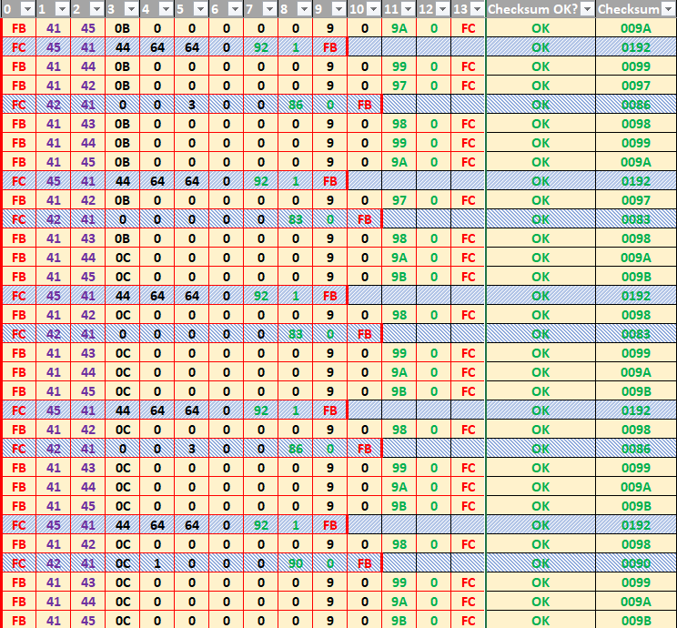
</details>
<details>
<summary><strong>3️⃣ Alan Tespiti (Payload Analizi)</strong></summary>

Payload içindeki alanları belirlemek için yaklaşık **4 dakikalık bir kullanım senaryosu** hazırlandı.  
Senaryoda hangi anda hangi işlemin yapıldığı tabloya döküldü:

| Zaman    | Olay                                           |
|----------|-----------------------------------------------|
| 00:04:00 | Açılış                                        |
| 00:07:00 | Mod Değişimi: AUTO → TURBO                    |
| 00:11:00 | Mod Değişimi: TURBO → ECO                     |
| 00:13:00 | Tetiğe basma – motoru çalıştırma (ECO)       |
| 00:20:00 | Tetiği bırakma – motoru durdurma (ECO)       |
| 00:21:00 | Tetiğe basma – motoru çalıştırma (ECO)       |
| 00:27:00 | Tetiği bırakma – motoru durdurma (ECO)       |
| 00:29:00 | Mod Değişimi: ECO → AUTO                      |
| 00:30:00 | Tetiğe basma – motoru çalıştırma (AUTO)      |
| 00:36:00 | Tetiği bırakma – motoru durdurma (AUTO)      |
| 00:38:00 | Tetiğe basma – motoru çalıştırma (AUTO)      |
| 00:42:00 | Tetiği bırakma – motoru durdurma (AUTO)      |
| 00:43:00 | Mod Değişimi: AUTO → TURBO                    |
| 00:45:00 | Tetiğe basma – motoru çalıştırma (TURBO)     |
| 00:52:00 | Tetiği bırakma – motoru durdurma (TURBO)     |
| 00:53:00 | Tetiğe basma – motoru çalıştırma (TURBO)     |
| 01:04:00 | Tetiği bırakma – motoru durdurma (TURBO)     |
| 01:05:00 | Tetik kilidi aktif                             |
| 01:08:00 | Tetiğe basma – motoru çalıştırma (TURBO)     |
| 01:08:00 | Tetiği bırakma                                 |
| 01:15:00 | Vakumu tıkama                                 |
| 01:16:00 | Vakumu açma                                   |
| 01:17:00 | Vakumu tıkama                                 |
| 01:18:00 | Vakumu açma                                   |
| 03:03:00 | Tetiğe basma – motoru durdurma (TURBO)       |
| 03:04:00 | Tetiği bırakma                                 |
| 03:06:00 | Tetiğe basma – motoru çalıştırma (TURBO)     |
| 03:06:00 | Tetiği bırakma                                 |
| 03:25:00 | Mod Değişimi: TURBO → ECO                     |
| 03:29:00 | Mod Değişimi: ECO → AUTO                      |
| 03:31:00 | Mod Değişimi: AUTO → TURBO                     |
| 03:34:00 | Mod Değişimi: TURBO → ECO                     |
| 03:40:00 | Tetiğe basma – motoru durdurma (TURBO)       |
| 03:40:00 | Tetiği bırakma                                 |
| 03:47:00 | Şarj aleti takma (%63)                        |
| 03:52:00 | Şarj aleti çıkarma (%63)                      |
| 03:56:00 | SON                                           |

---

## 📊 Payload Korelasyonu ve Batarya Seviyesi\n\n> **Not:** Bu dokümanda byte ve bit indeksleri 0'dan başlamaktadır.

- Kullanım senaryosu sırasında **lojik analizör** ile eş zamanlı olarak veri kaydedildi.  
- Excel tablosuna paketler aktarıldı, önceki formüller ve sütunlar kullanıldı.  
- Süpürgenin ekranında **batarya şarj seviyesi** canlı olarak gösteriliyor, dolayısıyla bataryadan gelen paketlerde bir **Batarya Seviyesi (Battery Level)** alanı olması gerektiği varsayıldı.  

### 🔹 Batarya Seviyesi (Battery Level) Alanının Tespiti

- Bataryadan süpürgeye gönderilen paketler (0xFC ile başlar, 0xFB ile biter) filtrelendi.  
- Kaynak ID’si **0x45** olan paketlerin **Byte 4** zamanla düşen bir eğilim gösterdi:  
  - Başlangıçta ondalık olarak 100  
  - Kullanım senaryosunun sonunda ondalık olarak 63  
- Bu byte **Batarya Seviyesi (Battery Level, %)** olarak işaretlendi.  

#### 🔹 Excel Formülü ve Görsel

- Tüm paketlerde Byte 4 üzerinden **Batarya Seviyesi** hesaplayan bir sütun eklendi.  
- Zaman ekseninde grafiği çizildi:

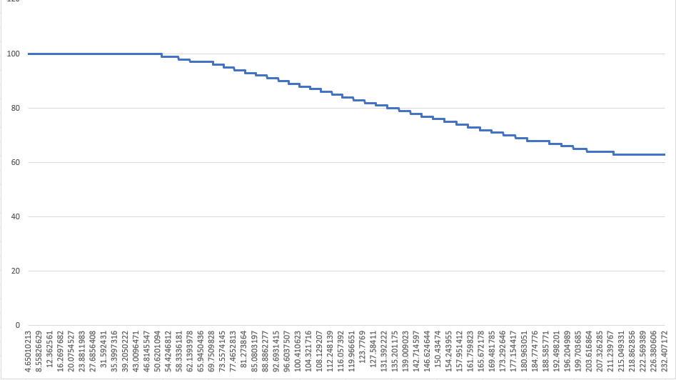

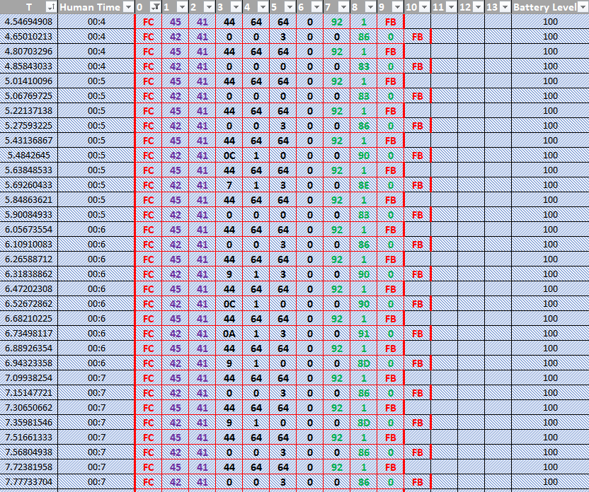 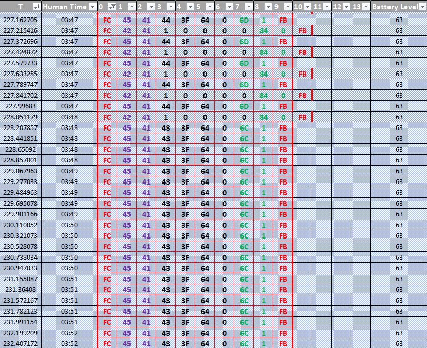

### 🔹 Şarj Durumu (Charger Status) Alanının Tespiti

Batarya tarafında alınması gereken bir diğer veri **şarj aleti takılma durumu**dur.  
- Süpürge ekranında anlık olarak gösterildiği için bataryadan gelen paketlerde bu bilgiyi içeren bir alan olmalıydı.  
- Kullanım senaryosunda şarj aleti takma/çıkarma anlarına karşılık gelen **byte ve bit** arandı:  
  - Kaynak ID: **0x45**  
  - Byte: **Byte 3**  
  - Bit: **Bit 3**  

Bu bitin durumu **1 → şarj aleti takılı**, **0 → şarj aleti çıkarıldı** olarak değerlendirildi.  

- Excel tablosuna yeni bir sütun eklenerek tüm paketler için bu bitin durumu hesaplandı.  
- Sonuçlar kullanım senaryosundaki olaylarla birebir uyumlu çıktı.  

#### 🔖 Charger Status Görseli

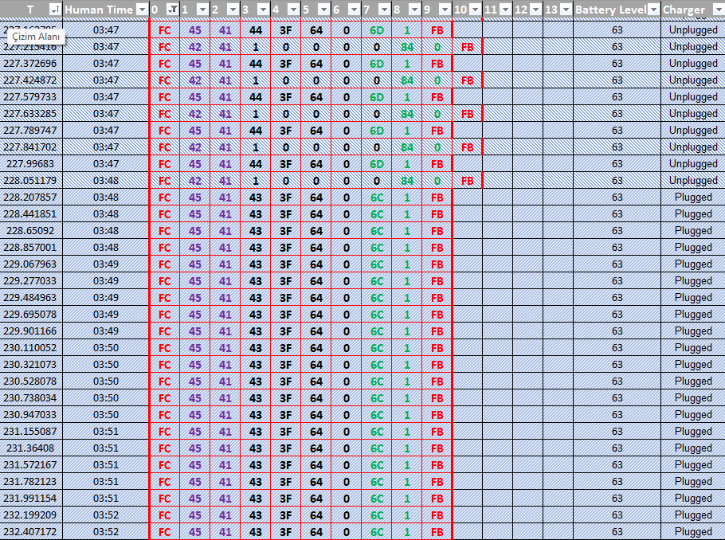

### 🔹 Güç Modu ve Motor Gücü Alanı Analizi

Kullanım senaryosunda süpürge, kasıtlı olarak **güç modları arasında geçişler** yaptı, durdurulup tekrar çalıştırıldı ve bazı anlarda tıkama ile kısa süreli zorlandı.  
Amaç: protokoldeki aynı ana denk gelen paketlerdeki değişimleri analiz etmek.

- Süpürge **3 güç kademesi** içeriyor: düşük → orta → yüksek  
- Mod değişimlerinde **motor devri, motor voltajı ve akım**da değişim bekleniyor  

#### 0x45 Kaynak ID’li Paket

- Bu pakette henüz anlamlandırılamayan **2 byte** bulunmaktadır. Bu alanların BMS hata veya durum bayrakları olduğu düşünülmektedir. Kullanılan batarya sağlıklı olduğundan ilgili hata durumları oluşturulamadı ve bu alanlar mevcut analiz kapsamında incelenmedi.

#### 0x42 Kaynak ID’li Paket

- Henüz keşfedilmeyi bekleyen **5 byte’lık payload alanı** mevcut  
- Analiz için **Byte 3 ve Byte 4 birleştirilerek 16-bit sayısal bir değer** hesaplandı  
- Tüm 0x42 paketleri filtrelendi ve Excel tablosuna eklenerek çizgi grafiği oluşturuldu  

#### 🔎 Sonuç

- Grafikte yaklaşık **45. saniyede 500 değerine ulaşan pikler** gözlendi  
- Öncesi ve sonrası, süpürge çalıştırma/durdurma ve tıkama anındaki dalgalanmalarla uyumlu  
- Cihazın teknik özelliklerine göre süpürgenin **500 W gücünde** olduğu biliniyor  
- Tüm bu bulgular, söz konusu **16-bit alanın watt cinsinden güç tüketimini** temsil ettiğini güçlü biçimde desteklemektedir  

### 🔖 Güç Tüketimi Grafiği

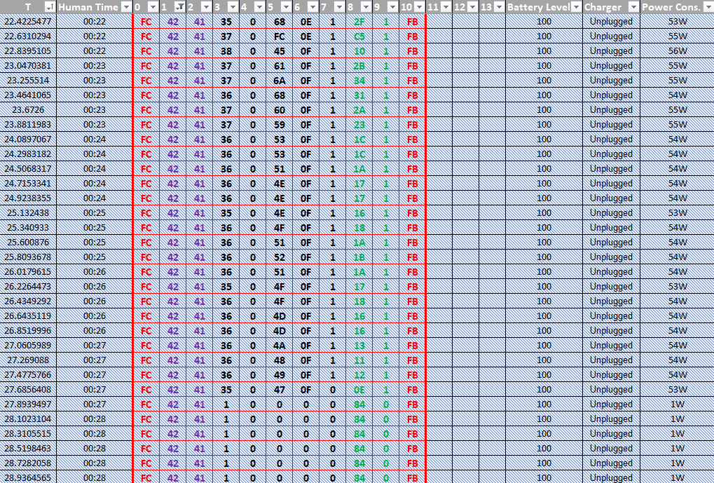 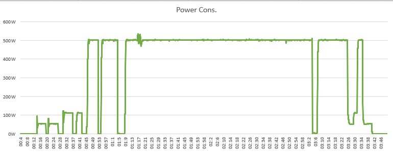

### 🔧 Akım (Current) Alanının Tespiti

- 0x42 kaynak ID’li paketlerdeki Byte 5 ve Byte 6 birleştirilerek 16-bit’lik bir sütun oluşturuldu.  
- Bu sütunun çizgi grafiği çıkarıldı ve analiz edildi.

Grafiğe bakıldığında:  

- Tıkama anında bariz pikler gözlemlendi
- Bir elektrik motorunun davranışına göre mantıklı: motor zorlandığında çektiği akım artar.  
- Bu durum grafikte açıkça gözleniyor.  
- Değerler cihazın nominal gücüyle kıyaslandığında biraz düşük görünüyor, bu nedenle birim kesin değil; Bu değer ham bir ADC verisi olabilir. Alternatif olarak motor tahmin edilenden daha yüksek bir gerilimde çalışıyorsa değerlerin amper cinsinden olması mümkün olabilir.  
- Tıkama ve mod geçişleri sırasında gözlenen örüntüler bu yorumla uyumludur; bu nedenle alan **akım (current)** verisi olarak değerlendirilmiştir.

### 🔖 Akım Grafiği

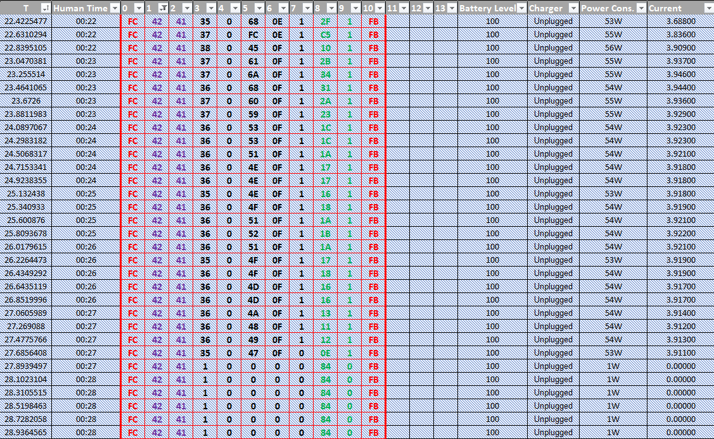 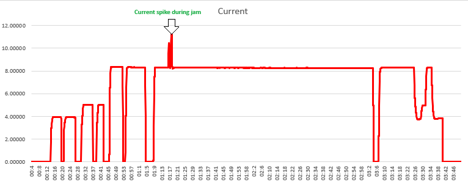

### 🔌 Voltaj (Voltage) Türetimi ve Akım Alanının Doğrulanması

Akım ve güç verilerini daha iyi anlamak ve akım alanındaki tespitimizi desteklemek için:

- Türetilmiş bir **voltaj sütunu** oluşturuldu:  
  - Formül: \( P = V × I \)  
  - Güç sütunları, akım (varsayılan) sütunlarına bölünerek hesaplandı.
- Oluşturulan voltaj sütununun çizgi grafiği çıkarıldı.

Grafik analizinde:

- **Tıkama anında voltaj düşümleri** gözlemlendi → elektrik motorlarının yük altında voltaj düşmesi beklenen bir davranış.
- **Motorun sıfır hızdan kalkış anlarında voltaj peakleri** mantıklı ve elektrik motorlarının karakteristiği ile uyumlu.
- Bu gözlemler, daha önce belirlenen **akım ve güç alanlarının kendi içinde tutarlı olduğunu** destekliyor.
- Bu sonuçlar, akım alanına ilişkin çıkarımı destekleyen ek kanıt sağlamıştır.

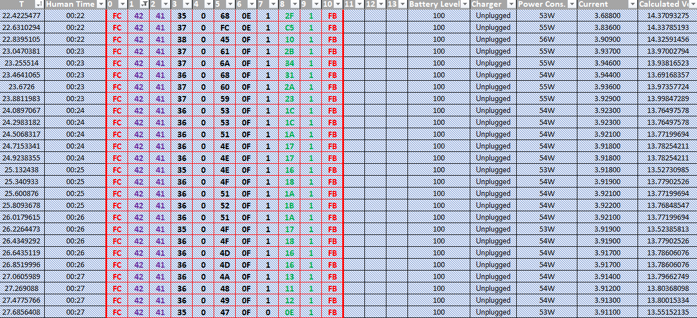 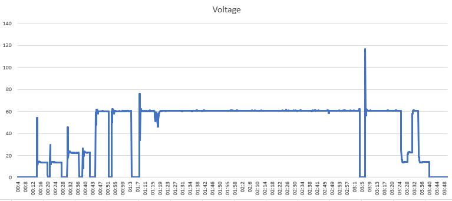

### 🔹 Motor Aktif/Deaktif Durumu (Motor Status)

0x42 kaynak ID'li paket üzerinde **yalnızca Byte 7** tespit edilememişti.  

- Bu byte incelendiğinde:
  - Motor çalışırken → 1  
  - Motor dururken → 0  

- Gözlemlerde bu davranış tüm kullanım senaryosu boyunca tutarlıydı.  
- Bu nedenle, **grafik oluşturmaya gerek kalmadan** bu byte doğrudan **Motor Aktif/Deaktif (Motor Status)** olarak işaretlendi.

## 🔹 Süpürge Paketleri: 0x41 Kaynak ID

Süpürgeden gelen **tek paket tipi** 0x41 kaynak ID’li paket incelenmiştir.  

- Tüm veri seti boyunca değişen alanlar: Byte 3, Byte 4, Byte 5 ve Byte 6.

      Byte 6 yalnızca 0 ve 1 değerlerini alabildiği için başlangıçta sonraki analize bırakılmıştır.

### 🔹 Byte 3, Byte 4 ve Byte 5 – Motor Devri / Komut Edilen Hız

- Byte 3, Byte 4 ve Byte 5 birleştirilerek 24 bitlik bir değer hesaplanmıştır.  
- Grafikte minimum: 0, maksimum: 128000 değerleri gözlemlenmiştir.  
- Akım ve güç grafiklerinde pattern ile uyum gözlemlenmiştir.

> Bu değerler, bu alanın motor devri olduğunu düşündürmüştür, çünkü 128000 RPM gibi bir değer bir vakum motoru için olması gereken yüksek devirdir.  
> Ancak grafiğin bu kadar stabil olması ve akım ile güç alanlarındaki dalgalanmaların görülmemesi, bunun bir **gerçek hız (actual velocity)** olmadığını, yalnızca **motor sürücüye gönderilen komut edilen hız (commanded velocity)** değeri olduğunu düşündürmektedir.

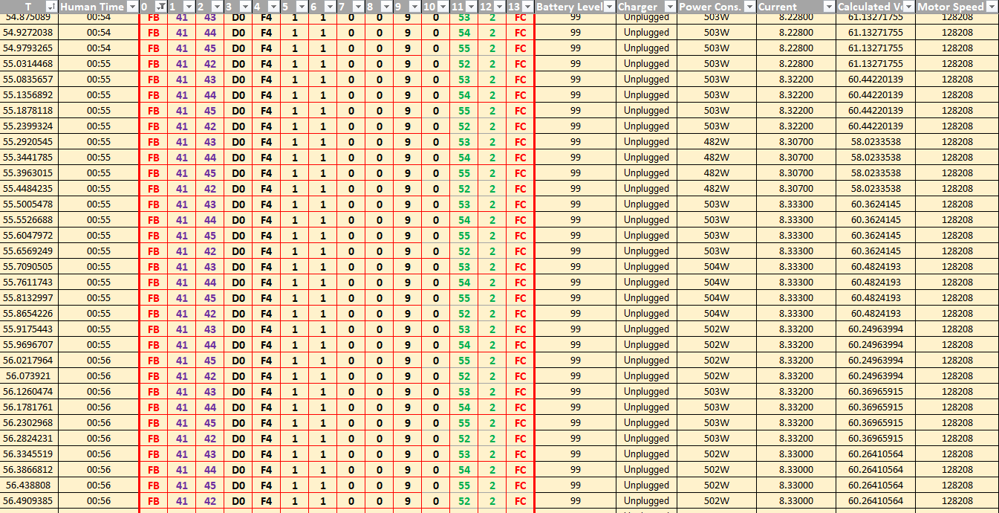 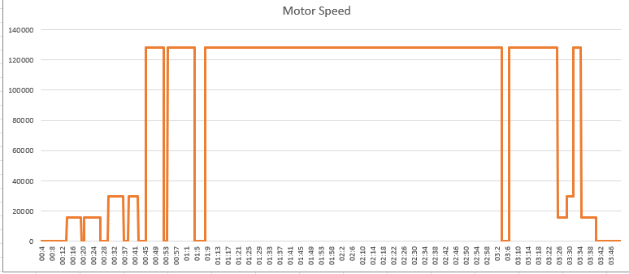

#### 🔹 Byte 6 – Tetik Durumu

- **Byte 6** tamamen **tetik basma / bırakma durumlarını** göstermektedir.  
  → 4 dakikalık kullanım senaryosunda tüm değişiklikler doğrulanmıştır.  

Diğer byte’larda kullanım senaryosu boyunca hiçbir değişiklik gözlemlenmemiştir.

---

# 📝 Sonuç: Çözülen Paketler ve Alanlar

## 1️⃣ Süpürgeden Bataryaya Gönderilen Paket (0x41 Kaynak ID)

| Byte | Field | Açıklama |
|------|------|----------|
| 0    | Packet Start | 0xFB |
| 1    | Source ID | 0x41 |
| 2    | Target ID | 0x42/0x43/0x44/0x45 |
| 3    | Motor Speed Low Byte | Motor devir değeri, 16–24 bit |
| 4    | Motor Speed Mid Byte | Motor devir değeri, 16–24 bit |
| 5    | Motor Speed High Byte | Motor devir değeri, 16–24 bit |
| 6    | Trigger Status | 0: Basılmamış, 1: Basılı |
| 7    | Unknown | Henüz çözülmedi |
| 8    | Unknown | Henüz çözülmedi |
| 9    | Unknown | Henüz çözülmedi |
| 10   | Unknown | Henüz çözülmedi |
| 11   | Checksum_L | Paket checksum |
| 12   | Checksum_H | Paket checksum |
| 13   | Packet End | 0xFC |

---

## 2️⃣ Bataryadan Süpürgeye Gönderilen Paket (0x45 Kaynak ID)

| Byte | Field | Açıklama |
|------|------|----------|
| 0    | Packet Start | 0xFC |
| 1    | Source ID | 0x45 |
| 2    | Target ID | 0x41 |
| 3    | Charger Status | 3. bit (0: Çıkarıldı, 1: Takıldı) |
| 4    | Battery Level | % cinsinden şarj durumu |
| 5    | Unknown | Henüz çözülmedi |
| 6    | Unknown | Henüz çözülmedi |
| 7    | Checksum_L | Paket checksum |
| 8    | Checksum_H | Paket checksum |
| 9    | Packet End | 0xFB |

---

## 3️⃣ Bataryadan Süpürgeye Gönderilen Paket (0x42 Kaynak ID)

| Byte | Field | Açıklama |
|------|------|----------|
| 0    | Packet Start | 0xFC |
| 1    | Source ID | 0x42 |
| 2    | Target ID | 0x41 |
| 3    | Power_L | Watt cinsinden güç tüketimi (16-bit) |
| 4    | Power_H | Watt cinsinden güç tüketimi (16-bit) |
| 5    | Current_L | Akım verisi (16-bit, birim tahmini) |
| 6    | Current_H | Akım verisi (16-bit, birim tahmini) |
| 7    | Motor Active Flag | 1: Motor çalışıyor, 0: Motor durdu |
| 8    | Unknown | Henüz çözülmedi |
| 9    | Unknown | Henüz çözülmedi |
| 10   | Checksum_L | Paket checksum |
| 11   | Checksum_H | Paket checksum |
| 12   | Packet End | 0xFB |

# 🔹 Anlamlandırılan Byte Oranı (Payload Coverage)

| Paket | Toplam Byte | Analiz Edilen Byte | Coverage |
|-------|------------|------------------|----------|
| 0x41  | 14         | 10               | 71%      |
| 0x45  | 10         | 8                | 80%      |
| 0x42  | 13         | 11               | 85%      |
| **Toplam** | 37     | 29               | **~78%** |

> Çözülemeyen byte’lar ya sabit/padding alanlarıdır ya da henüz aktif olmayan protokol field’larıdır.
> Elde edilen veriler, batarya emulasyonunu yapıp süpürgeyi tüm fonksiyonları ile çalıştırmaya yeterlidir.

</details>

<details>
<summary><strong>4️⃣ Protokol Emülasyonu</strong></summary>

Protokol emülasyonu aşamasında, mikroişlemci olarak **ESP32** tercih edilmiştir. ESP32, kolay erişilebilirliği, geliştirme ortamının rahatlığı ve entegre Wi-Fi özelliği sayesinde projeyi ileri IoT senaryolarına hazırlamak için ideal bir platform sağlar.  

Daha önce lojik analizör bağlantısı için hazırlanan ve kullanılan **logic level shifter**, ESP32’nin UART bağlantısı için tekrar kullanılmıştır. Single-wire UART yapısında hem RX hem de TX aynı hat üzerinden geçtiği için yalnızca **GPIO16** üzerinden bağlantı yeterli olmuştur.  

Yazılım tarafında bir **haberleşme arayüzü sınıfı (communication interface class)** geliştirilmiştir. Bu class:

- Tek hatlı UART portu dinleme modunda RX, yazma modunda TX yönüne geçirir.
- Dinleme modundayken master’dan (süpürgeden) gelen her paketteki **Target ID**’ye göre uygun yanıtı **data buffer**’ından alır.
- TX moduna geçerek protokolü kesintisiz işletir.
- `begin()` fonksiyonu çağrıldığında kendi **FreeRTOS iş parçacığını (thread)** başlatır ve bu iş parçacığındaki döngüde protokol sürekli olarak çalışır.

Testler için:

- **GPIO33** ADC giriş → Batarya voltajı alanı simülasyonu
- **GPIO26** dijital giriş → Charger status alanı simülasyonu  

Bu yapı sayesinde uygulama katmanında yalnızca **communication interface**’i başlatmak ve **data buffer**’daki ilgili byte’ları okumak veya yazmak yeterlidir.  

Firmware'e erişim için [buraya tıklayabilirsiniz](SOFTWARE/G11_Battery_Controller).

Haberleşme arayüzünün testlerini yapıp doğruladıktan sonra, uygulama katmanında ilk olarak **Battery Level** alanını sürekli olarak artıran ve 100’ü geçtiğinde tekrar 0’a döndüren bir test yazılmıştır. Bu test ile emülasyon denemelerine başlanmıştır ve **ilk denemede protokol başarıyla taklit edilmiştir**.  


İkinci aşama olarak, daha önce tanımlanan **ADC girişi (GPIO33)** üzerinden bağlanan potansiyometre ile **Battery Level** ve **dijital giriş (GPIO26)** üzerinden **Charger Status** alanları manipüle edilmiştir. Bu sayede batarya durumu pot ile kontrol edilirken, şarj aleti durumu dijital giriş ile değiştirilmiştir. Yapılan testler de başarılı sonuç vermiştir.  


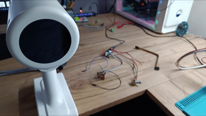 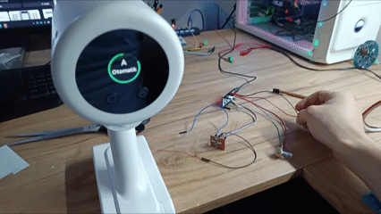


Süpürgeden gelen veriler hâlihazırda alınabildiği için, yazılım geliştirme açısından yeterli altyapıyı sağladığımı düşündüğümden yazılımı bu seviyede bırakıyorum.  
Gerekli **BMS devresi** ve diğer çevre birimler eklendiğinde, orijinal bataryayı tam anlamıyla taklit edebilecek bir emülasyon altyapısı sağlanmış olacaktır.

</details>

<details>
<summary><strong>5️⃣ Donanım Arayüz Tasarımı</strong></summary>

Şimdi yedek batarya üretimi yolundaki bir sonraki aşamaya geçerek donanım tasarımının temellerini atacağız.  

Orijinal batarya daha önce bahsettiğimiz **UI+ / UI- pinlerinde**, normal durumda gerilim sağlamaz. Süpürge **tetik basılıp KEY sinyali gönderildiğinde**, belirli bir zaman aşımı süresince **UI beslemesini açar** ve besleme alındığında haberleşmeyi başlatır. Herhangi bir aktivite olmazsa güç tasarrufu için besleme kesilir. Bu nedenle UI hatlarını doğrudan 24V’a bağlayamayız.  

Buna çözüm olarak, **UI hatlarını anahtarlayabileceğimiz bir anahtarlama devresi** kurdum ve ESP32 I/O pinlerine bağladım.  
Ek güvenlik amacıyla **sistem genel gücünü de anahtarlayabilir** yapmak istedim ve bunun için ayrı bir anahtarlama devresi ile MCU beslemesi için bir **DC-DC düşürücü (buck) dönüştürücü** kullandım. Bu düzenlemeleri **şematiğin power sayfasında** görebilirsiniz. 

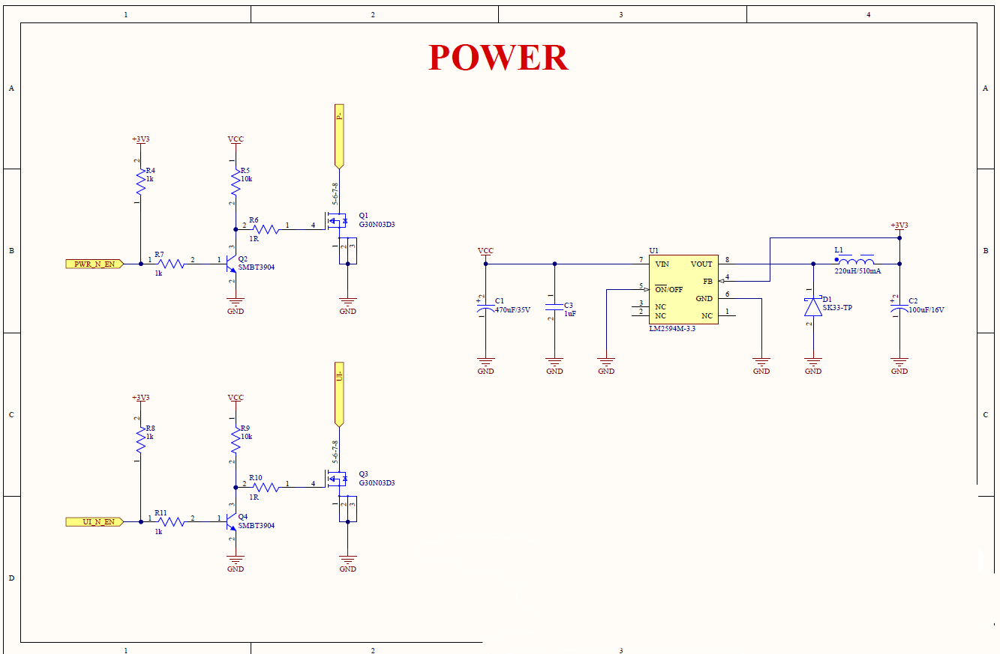 

Ayrıca MCU, batarya seviyesini anlık ölçüp süpürgeye bildirmesi gerektiği için **5S seri batarya voltajını 0–3.3V aralığına ölçekleyecek bir gerilim bölücü** ile ADC girişine bağladım. Buradan batarya voltajını ölçebileceğiz.  

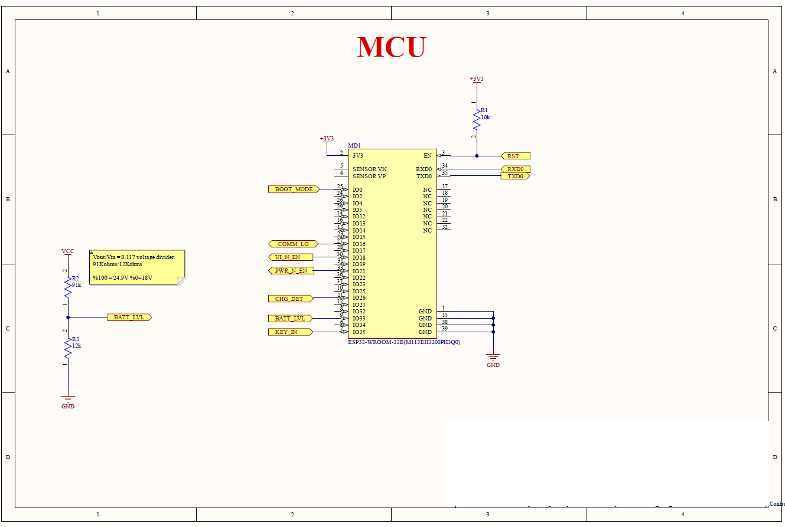 

Testlerde kullandığım **çift yönlü seviye dönüştürücü (bidirectional level shifter)** yapısı da aynı şekilde şematiğe dahil edilmiştir.  

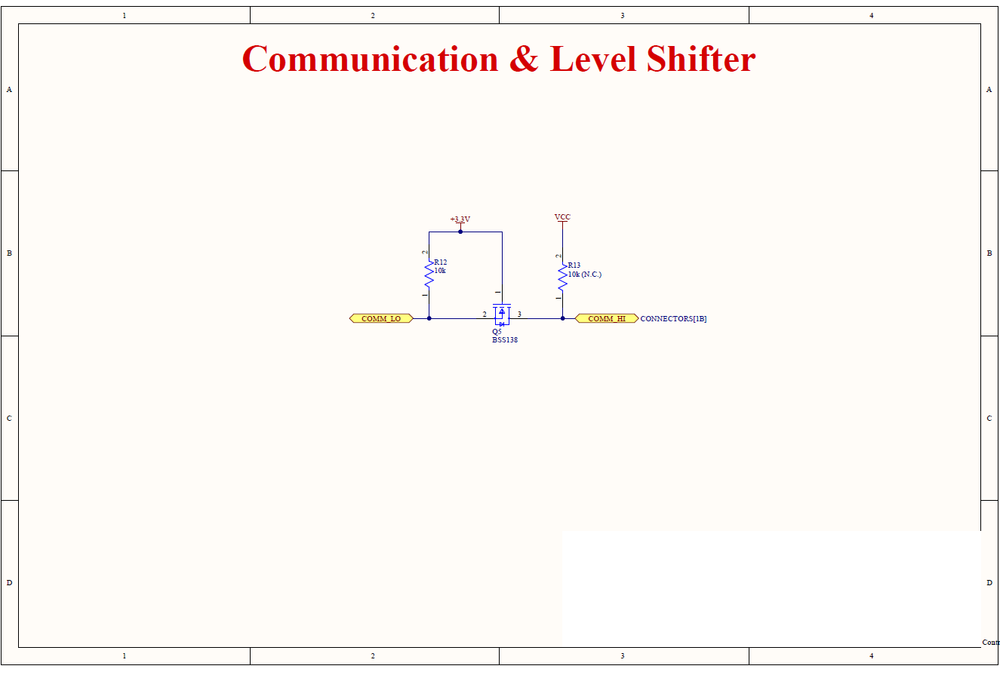 

Şarj aleti bağlantısını tespit etmek için yine bir **gerilim bölücü** ile şarj girişini dijital IO’ya bağladım.  

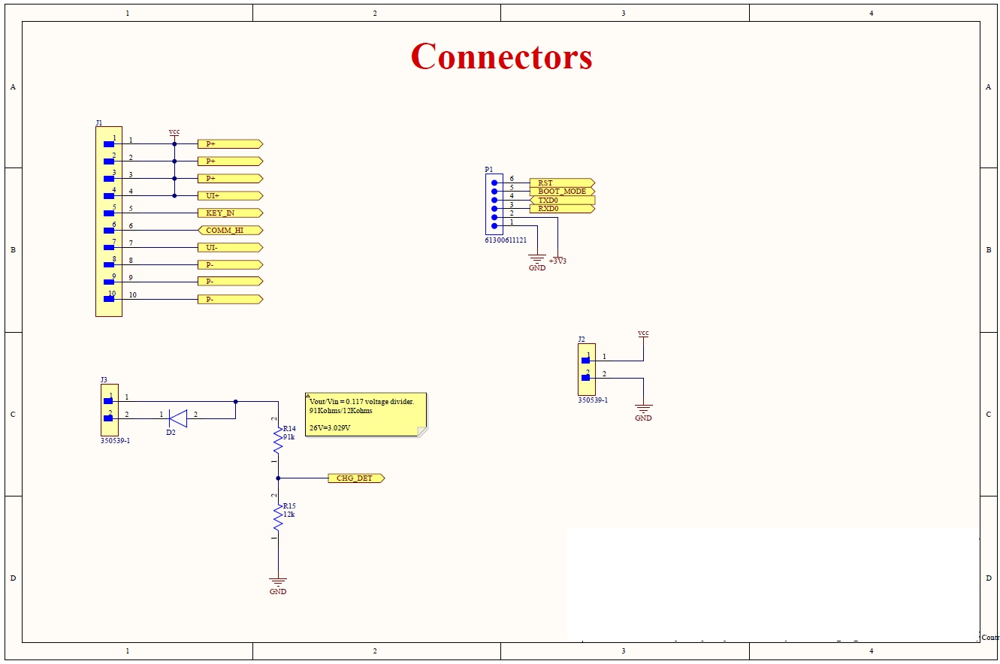 

Bu düzenlemeler, sadece orijinal bataryanın tüm fonksiyonlarını sağlamış olmakla kalmaz, aynı zamanda **Wi-Fi özelliği kazandırarak** bataryayı ileri IoT özellikli bir cihaza dönüştürür.
Tüm şematik ve PCB projesine [buradan](HARDWARE/G11%20Battery%20Controller) erişebilirsiniz.
</details>
<details>
<summary><strong>🎁 Bonus: Batarya Kasa 3D Tasarımı</strong></summary>

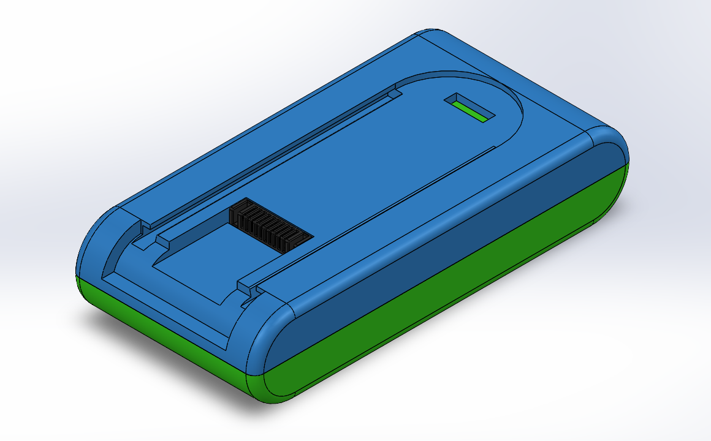 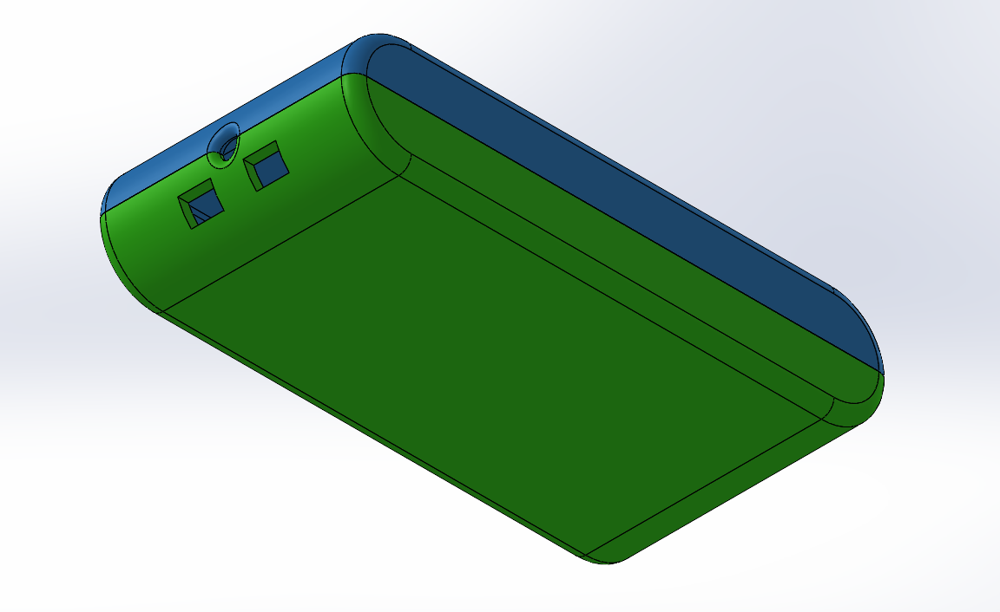

Bataryanın fiziksel kutusunun 3D tasarım dosyaları [buraya](3D/g11%20battery%20case) bakabilirsiniz.

</details>
